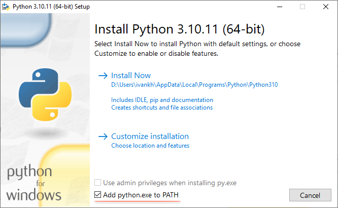

# Frequently Asked Questions

We often see a lot of questions that surface repeatedly. This repository is an attempt to gather some of those and provide some answers!

## Table of contents

* [General Questions](#general-questions)
  * [Is Windows supported?](#is-windows-supported)
  * [Are SageMaker notebook instances supported?](#are-sagemaker-notebook-instances-supported)
  * [How do you start the SSM session without knowing EC2 instance or container ID?](#how-do-you-start-the-ssm-session-without-knowing-ec2-instance-or-container-id)
  * [For training, should I use Warm Pools or SageMaker SSH Helper?](#for-training-should-i-use-warm-pools-or-sagemaker-ssh-helper)
  * [How can I do remote development on a SageMaker training job, using SSH Helper?](#how-can-i-do-remote-development-on-a-sagemaker-training-job-using-ssh-helper)
  * [Can I also use this solution to connect into my jobs from SageMaker Studio?](#can-i-also-use-this-solution-to-connect-into-my-jobs-from-sagemaker-studio)
  * [How SageMaker SSH Helper protects users from impersonating each other?](#how-sagemaker-ssh-helper-protects-users-from-impersonating-each-other)
  * [How to troubleshoot jobs that are failing with the exception or error?](#how-to-troubleshoot-jobs-that-are-failing-with-the-exception-or-error)
  * [I see folders like Desktop, Documents, Downloads, Pictures in SageMaker Studio, is it fine?](#i-see-folders-like-desktop-documents-downloads-pictures-in-sagemaker-studio-is-it-fine)
  * [I'm running SageMaker in a VPC. Do I need to make extra configuration?](#im-running-sagemaker-in-a-vpc-do-i-need-to-make-extra-configuration)
  * [When debugging a training job with SageMaker SSH Helper and train_placeholder.py, I want to automatically stop the job when there are no users connected and there's no GPU utilization. How to do that?](#when-debugging-a-training-job-with-sagemaker-ssh-helper-and-training-placeholder-i-want-to-automatically-stop-the-job-when-there-are-no-users-connected-and-theres-no-gpu-utilization-how-to-do-that)
  * [I want to send users the SMS or email notification when the placeholder training job has issues with low GPU utilization. How to do that?](#i-want-to-send-users-the-sms-or-email-notification-when-the-placeholder-training-job-has-issues-with-low-gpu-utilization-how-to-do-that)
* [API Questions](#api-questions)
  * [I'm using boto3 Python SDK instead of SageMaker Python SDK, how can I use SageMaker SSH Helper?](#im-using-boto3-python-sdk-instead-of-sagemaker-python-sdk-how-can-i-use-sagemaker-ssh-helper)
  * [How can I change the SSH authorized keys bucket and location when running sm-ssh command?](#how-can-i-change-the-ssh-authorized-keys-bucket-and-location-when-running-sm-ssh-command)
  * [What if I want to train and deploy a model as a simple Estimator in my own container, without passing entry_point and source_dir?](#what-if-i-want-to-train-and-deploy-a-model-as-a-simple-estimator-in-my-own-container-without-passing-entry_point-and-source_dir)
  * [What if I want to deploy a Multi Data Model without passing a reference to a Model object, only with image_uri?](#what-if-i-want-to-deploy-a-multi-data-model-without-passing-a-reference-to-a-model-object-only-with-image_uri)
  * [What if I want to use an estimator in a hyperparameter tuning job (HPO) and connect to a stuck training job with SSM?](#what-if-i-want-to-use-an-estimator-in-a-hyperparameter-tuning-job-hpo-and-connect-to-a-stuck-training-job-with-ssm)
  * [How to start a job with SageMaker SSH Helper in an AWS Region different from my default one?](#how-to-start-a-job-with-sagemaker-ssh-helper-in-an-aws-region-different-from-my-default-one)
  * [How to configure an AWS CLI profile to work with SageMaker SSH Helper?](#how-to-configure-an-aws-cli-profile-to-work-with-sagemaker-ssh-helper)
  * [How do I automate my pipeline with SageMaker SSH Helper end-to-end?](#how-do-i-automate-my-pipeline-with-sagemaker-ssh-helper-end-to-end)
  * [Can I connect from my local machine to Jupyter Server in addition to Kernel Gateways?](#can-i-connect-from-my-local-machine-to-jupyter-server-in-addition-to-kernel-gateways)
  * [How do I securely forward my local private SSH keys from local machine to the remote host with SSH Agent?](#how-do-i-securely-forward-my-local-private-ssh-keys-from-local-machine-to-the-remote-host-with-ssh-agent)
  * [Can I use SSH Helper on large language model inference endpoints deployed by Deep Learning Containers for LMI?](#can-i-use-ssh-helper-on-large-language-model-inference-endpoints-deployed-by-deep-learning-containers-for-lmi)
* [Troubleshooting](#troubleshooting)
  * [Something doesn't work for me, what should I do?](#something-doesnt-work-for-me-what-should-i-do)
  * [I’m getting an API throttling error in the logs](#im-getting-an-api-throttling-error-in-the-logs)
  * [How can I see which SSM commands are running in the container?](#how-can-i-see-which-ssm-commands-are-running-in-the-container)
  * [How can I clean up offline instances from System Manager?](#how-can-i-clean-up-offline-instances-from-system-manager)
  * [There's a big delay between getting the mi-* instance ID and until I can successfully start a session to the container.](#theres-a-big-delay-between-getting-the-mi--instance-id-and-until-i-can-successfully-start-a-session-to-the-container)
  * [I get an error about advanced-instances tier configured incorrectly](#i-get-an-error-about-advanced-instances-tier-configured-incorrectly)


## General Questions

### Is Windows supported?

The solution was primarily designed for developers who are using Linux and macOS.

Basic scenarios, which require only SSM without SSH, work on Windows without 
any additional configuration.

To be able to connect from your local machine with SSH and start port forwarding with the script `sm-ssh`, please consider that 
you need Bash interpreter and Python to execute them. They don't work in PowerShell or in the default Command Prompt.

However, it's possible also to make it working on Windows, with some limitations on use from IDEs that use the Command Prompt.

The installation steps are (tested on Windows 10):

1. If Python is not yet installed in your system, you can download it from [the official website](https://www.python.org/downloads/windows/).

When installing, make sure you've selected the option to include Python into environment variables (into PATH):



Make sure that the Python version is compatible with your version of [SageMaker Python SDK](https://github.com/aws/sagemaker-python-sdk/blob/master/README.rst) (at the moment of writing, the latest version of SDK supported Python 3.8, 3.9 and 3.10). Later versions of Python might not work as expected in combination with SageMaker SSH Helper.

2. Install the "Git Bash".

We recommend obtaining Bash by installing [Git for Windows](https://gitforwindows.org/) distribution that contains the MINGW64 version of Bash.
This method works well with both Windows running on a local machine and Windows running inside an [Amazon WorkSpaces](https://aws.amazon.com/workspaces/) environment.

3. Run the "Git Bash" application.

4. Install SageMaker SSH Helper:

```shell
$ pip install sagemaker-ssh-helper
```

5. Install [AWS CLI v2 for Windows](https://docs.aws.amazon.com/cli/latest/userguide/getting-started-install.html) and [Session Manager plugin](https://docs.aws.amazon.com/systems-manager/latest/userguide/install-plugin-windows.html) for Windows by running the following command:

```bash
sm-local-configure
```

If during install you see messages that there are some missing executables like `msiexec` that are supposed to be in your system PATH, restart Git Bash to update the PATH and repeat the step again.

6. Re-start Git Bash for AWS CLI and the plugin to appear in the PATH.

7. Make sure you've configured AWS profiles and the AWS Region either in `~/.aws/config` or through environment variables.

This short and handy command should give you the listing of your S3 buckets and execute without errors, if your credentials are correct:

```bash
aws s3 ls
aws configure list | grep region
```

The last command should show that the region is coming either from `~/.aws/config` or through environment variables. 
The `imds` source may not work with SSH Helper. Update the config file or export it only for the current session:

```bash
export AWS_DEFAULT_REGION=eu-west-1
```

8. Now you can use the `sm-ssh` command from Git Bash:

```bash
sm-ssh list
```

### Are SageMaker notebook instances supported?

Yes, the setup is similar to SageMaker Studio. Run [SageMaker_SSH_Notebook.ipynb](SageMaker_SSH_Notebook.ipynb) on the notebook instance and `sm-ssh connect <<notebook-instance-name>>.notebook.sagemaker` your local machine. 

Review the instructions for [SageMaker Studio integration with PyCharm / VSCode](README.md#studio) for more details. 

Note that unlike SSH Helper integration with SageMaker Studio, SSH Helper for SageMaker notebook instances doesn't support VNC or remote notebook connection. Connecting to notebook instances with SageMaker SSH Helper is more akin to connecting to a training job. It uses [SageMaker local mode](https://sagemaker.readthedocs.io/en/stable/overview.html?#local-mode) to run the container with the SSM agent.


### How do you start the SSM session without knowing EC2 instance or container ID?

Indeed, when you run a SageMaker job, there are no EC2 instances or generic containers visible in AWS console, because the instances and containers are managed by the SageMaker service.
The trick that SageMaker SSH Helper is using is [the hybrid activations](https://docs.aws.amazon.com/systems-manager/latest/userguide/systems-manager-managedinstances.html) in AWS Systems Manager (SSM), with SageMaker containers effectively becoming managed instances when SSM agent starts, akin to on-premises instances. The managed instances have an ID that starts with `mi-` prefix and once they connect to the Systems Manager, you're able to see them in AWS Console in Systems Manager -> Node Manager -> Fleet Manager section.
You need to turn on the [Advanced Tier](https://docs.aws.amazon.com/systems-manager/latest/userguide/systems-manager-managedinstances-advanced.html) in Systems Manager to be able to connect with the Session Manager and hence with the SSH Helper to these instances.


### For training, should I use Warm Pools or SageMaker SSH Helper?

SageMaker [Warm Pools](https://docs.aws.amazon.com/sagemaker/latest/dg/train-warm-pools.html) is a built-in SageMaker Training feature which is great when you want to use the SageMaker API to:

1. Run a series of relatively short training jobs, each job outputting a different model based on different input data (like a model per customer).
2. Interactively iterate over a series of training jobs, changing code and hyperparameters between jobs. Job launch time will be less than 30sec. When using warm pools, all training jobs are audited and logged. Warm Pools is a built-in product feature, which you can use after you [opt in](https://docs.aws.amazon.com/sagemaker/latest/dg/train-warm-pools.html#train-warm-pools-resource-limits). 

You’re billed as long as the warm pool didn't expire.

[SageMaker SSH Helper](https://github.com/aws-samples/sagemaker-ssh-helper) is a field solution for SageMaker, focused on interactive work. Enabling use cases like: 

1. The shell access to the SageMaker training container to monitor and troubleshoot using OS tools. 
2. Setup remote development/debugging experience, using your IDE to code, and run processes in the SageMaker container. 

SSH Helper's interactive nature allows you to iterate in seconds, by running multiple commands/experiment reusing one running training job. SSH Helper requires [setting up your AWS account with IAM and SSM configuration](https://github.com/aws-samples/sagemaker-ssh-helper/blob/main/IAM_SSM_Setup.md). You’re billed as long the training job is running. 

### How can I do remote development on a SageMaker training job, using SSH Helper?
Start a SageMaker Training job that will run a dummy training script which sleeps forever, then use remote development 
to carry out any activities on the training container. Note, this idea and the script `train_placeholder.py` is also 
introduced in the documentation in the section [Remote code execution with PyCharm / VSCode over SSH](https://github.com/aws-samples/sagemaker-ssh-helper#remote-code-execution-with-pycharm--vscode-over-ssh).

### Can I also use this solution to connect into my jobs from SageMaker Studio?

Yes, requires adding same IAM permissions to SageMaker role as described in the [IAM_SSM_Setup.md](IAM_SSM_Setup.md#4-optional-connecting-from-sagemaker-studio) for your local role (step 4 in manual setup).

### How SageMaker SSH Helper protects users from impersonating each other?

This logic is enforced by IAM policy. See the manual step 3 in [IAM_SSM_Setup.md](IAM_SSM_Setup.md#manual-setup) 
for a policy example.

It works as follows: the SageMaker SSH Helper assigns on behalf of the user the tag `SSHOwner`
with the value that equals a local user ID (see [the source code for SSH wrappers](https://github.com/aws-samples/sagemaker-ssh-helper/blob/57b1f6369ce9e523a7951d23753a9f7f5a6a2022/sagemaker_ssh_helper/wrapper.py#L62)).
For integration with SageMaker Studio the user ID is passed in [the notebook](https://github.com/aws-samples/sagemaker-ssh-helper/blob/main/SageMaker_SSH_IDE.ipynb) as the argument to 
`sm-ssh-ide init-ssm` command and configured by the `LOCAL_USER_ID` variable.

When a user attempts to connect to an instance, IAM will authorize the user based 
on their ID and the value of the `SSHOwner` tag. The user will be denied to access the instance 
if the instance doesn't belong to them.

Another important part of it is the IAM policy with `ssm:AddTagsToResource` action, described in the manual step 2.
Limiting this action only to SageMaker role as a resource will allow adding and updating tags only for
the newly created activations (instances) and not for existing ones that may already belong to other users.

### How to troubleshoot jobs that are failing with the exception or error?
When the job is failing, the container stops, and you're not able to connect to the container anymore with SSM or SSH.

To troubleshoot this situation, use the trick with `train_placeholder.py` described in the [README.md](README.md), and start your training script from the terminal or with the remote interpreter while the dummy script is running.

A variation of this solution is to create a wrapper script, which executes your training script and sleeps forever after the training script exits. This is how after getting an error in CloudWatch you will be able to connect to the same container with SSM/SSH and troubleshoot its state.

### I see folders like Desktop, Documents, Downloads, Pictures in SageMaker Studio, is it fine?

Yes, it's fine. They don't contain any of your local data. These are the freshly created folders by the VNC server and XFC4 remote desktop environment. You will see them if you connect to SageMaker Studio with VNC client, as described [in the IDE integration section of the documentation](README.md#studio).

### I'm running SageMaker in a VPC. Do I need to make extra configuration?

Yes. By default, SageMaker SSH Helper requires access to Internet to download and install extra packages inside SageMaker, such as AWS CLI and Sessions Manager Agent.
If you're running SageMaker inside a VPC with private subnets, you will need a NAT gateway to access Internet.

Alternatively, you can run SageMaker SSH Helper in the VPC without Internet access, but you will need to build [your custom containers](https://medium.com/@pandey.vikesh/why-bring-your-own-container-to-amazon-sagemaker-and-how-to-do-it-right-bc158fe41ed1) for jobs and [for SageMaker Studio](https://docs.aws.amazon.com/sagemaker/latest/dg/studio-byoi.html).
During the container build, execute `sm-setup-ssh configure` and `sm-ssh-ide configure` commands respectively, to cache and pre-install all dependencies.

See the examples of such containers [byoc/Dockerfile.internet_free](https://github.com/aws-samples/sagemaker-ssh-helper/blob/main/tests/byoc/Dockerfile.internet_free) and [byoi_studio/Dockerfile.internet_free](https://github.com/aws-samples/sagemaker-ssh-helper/blob/main/tests/byoi_studio/Dockerfile.internet_free) in the tests.

You will also need to configure AWS PrivateLink for [Session Manager endpoints](https://docs.aws.amazon.com/systems-manager/latest/userguide/session-manager-getting-started-privatelink.html) and for [STS endpoints](https://docs.aws.amazon.com/IAM/latest/UserGuide/id_credentials_sts_vpce.html).

*Note:* If you are using the [Network Isolation](https://docs.aws.amazon.com/sagemaker/latest/dg/mkt-algo-model-internet-free.html) mode, i.e., set the `enable_network_isolation` parameter of the `Estimator` to `True`, you won't be able to connect to your containers, because they will have no access to the Amazon Systems Manager.

### When debugging a training job with SageMaker SSH Helper and training placeholder, I want to automatically stop the job when there are no users connected and there's no GPU utilization. How to do that?

To stop the job when no users connected, consider using `sagemaker_ssh_helper.is_last_session_timeout(timedelta)` method, as already described in the section [Remote code execution](README.md#remote-code-execution-with-pycharm-vscode-over-ssh). The method will count active SSM sessions, and time out when there are no sessions left. 

To stop the job when there's no GPU utilization, consider using SageMaker Profiler and [LowGPUUtilization rule](https://docs.aws.amazon.com/sagemaker/latest/dg/debugger-built-in-rules.html#low-gpu-utilization), in combination with `sagemaker_ssh_helper.is_profiler_issues_found()` method.

Your `train_placeholder.py` script then may look like as below. It will stop and the job will complete, if the container is left unattended and profiler found issues like low GPU utilization:

```python
import time
import os
from datetime import timedelta

from sagemaker_ssh_helper import setup_and_start_ssh, is_last_session_timeout, is_profiler_issues_found

setup_and_start_ssh()

os.environ["AWS_DEFAULT_REGION"] = os.environ.get("AWS_REGION", "")  # for boto3

while True:
    time.sleep(10)
    if is_last_session_timeout(timedelta(minutes=5)) and is_profiler_issues_found():
        break
```

To execute this script with SageMaker Profiler, pass extra configuration parameters to the job:

```python
import os
from datetime import timedelta

from sagemaker.pytorch import PyTorch
from sagemaker.debugger import ProfilerRule, rule_configs, ProfilerConfig

from sagemaker_ssh_helper.wrapper import SSHEstimatorWrapper


profiler_config = ProfilerConfig(
    system_monitor_interval_millis=100,  # grab metrics 10 times per second
)
rules = [
    ProfilerRule.sagemaker(rule_configs.LowGPUUtilization(
        scan_interval_us=60 * 1000 * 1000,  # scan every minute
        patience=2,  # skip the first 2 minutes
        threshold_p95=50,  # GPU should be at least 50% utilized, 95% of the time
        threshold_p5=0,  # skip detecting accidental drops
        window=1200,  # take the last 1200 readings, i.e., the last 2 minutes
    )),
]

estimator = PyTorch(
    entry_point='train_placeholder.py',
    source_dir='source_dir/training_placeholder/',
    dependencies=[SSHEstimatorWrapper.dependency_dir()],
    base_job_name='ssh-training-low-gpu',
    framework_version='1.9.1',
    py_version='py38',
    instance_count=1,
    instance_type='ml.g4dn.xlarge',
    max_run=int(timedelta(minutes=15).total_seconds()),
    profiler_config=profiler_config,
    rules=rules
)

ssh_wrapper = SSHEstimatorWrapper.create(estimator, connection_wait_time_seconds=0)

estimator.fit(wait=False)

status = ssh_wrapper.wait_training_job_with_status()
```

*Tip:* To avoid unnecessary disruption of users' work, consider sending them notification emails instead of stopping their jobs automatically. See [the related notification question](FAQ.md#i-want-to-send-users-the-sms-or-email-notification-when-the-placeholder-training-job-has-issues-with-low-gpu-utilization-how-to-do-that).


### I want to send users the SMS or email notification when the placeholder training job has issues with low GPU utilization. How to do that?

First, you need to detect the low GPU utilization [with SageMaker Profiler](FAQ.md#when-debugging-a-training-job-with-sagemaker-ssh-helper-and-training-placeholder-i-want-to-automatically-stop-the-job-when-there-are-no-users-connected-and-theres-no-gpu-utilization-how-to-do-that).

When the SageMaker Profiler job, which is a SageMaker Processing job running the SageMaker Debugger container, finds issues with a Training job, it stops. 

So the trick here is to listen for the [Amazon EventBridge events](https://docs.aws.amazon.com/sagemaker/latest/dg/automating-sagemaker-with-eventbridge.html) when a SageMaker Processing job changes the status. Then to check if it's the completed SageMaker Debugger job, and if yes, check the profiler issues of the related training job. In case there are issues found, send the notification to the [Amazon SNS](https://aws.amazon.com/sns/) topic.

See the [CDK code to deploy the Lambda and the EventBridge rule](https://github.com/aws-samples/sagemaker-ssh-helper/tree/main/sagemaker_ssh_helper/cdk/low_gpu) for more details.

To deploy the stack into your environment with CDK, run these commands: 

```bash
APP="python -m sagemaker_ssh_helper.cdk.low_gpu_lambda_app"
AWS_REGION=$REGION cdk -a "$APP" deploy Low-GPU-Lambda-Stack \
    -c sns_notification_topic_arn="$SNS_NOTIFICATION_TOPIC_ARN" 
```

## API Questions

### I'm using boto3 Python SDK instead of SageMaker Python SDK, how can I use SageMaker SSH Helper?
This use case is not fully supported by SageMaker SSH Helper.
However, [you can](https://repost.aws/questions/QU8-U_XgPVRSuLTSXf8eW8fA/can-we-connect-to-the-instance-via-ssh-or-other-means-where-a-triton-sagemaker-endpoint-is-deployed) analyze the source code and re-implement SageMaker SSH Helper behaviour with boto3, e.g., by passing environment variables from your code.

In general, this is not recommended, because the set of environment variables and internal logic is a subject to future changes. These changes won't necessarily appear in the release notes and can break your code.

However, if submitted a job with boto3 in this way and started SSH Helper inside the container, you can use high-level APIs to fetch instance IDs and connect to the job with `sm-ssh` script from your local machine:

```python
from sagemaker_ssh_helper.wrapper import SSHEstimatorWrapper

training_job_name = ...

ssh_wrapper = SSHEstimatorWrapper.attach(training_job_name)

ssh_wrapper.print_ssh_info()
```

The last `print_ssh_info()` function will give you connection details.

### How can I change the SSH authorized keys bucket and location when running `sm-ssh` command?
The **public** key is transferred to the container through the default SageMaker bucket with the S3 URI that looks 
like `s3://sagemaker-eu-west-1-555555555555/ssh-authorized-keys/`.
If you want to change the location to your own bucket and path, export the variable like this:
```
export SSH_AUTHORIZED_KEYS_PATH=s3://DOC-EXAMPLE-BUCKET/ssh-public-keys-jane-doe/  
sm-ssh connect fqdn.sagemaker
```

### What if I want to train and deploy a model as a simple Estimator in my own container, without passing entry_point and source_dir?

In some cases, you don't want to pass any external scripts or libraries to the training job or the inference endpoint and want to put everything into [your own container](https://sagemaker-examples.readthedocs.io/en/latest/advanced_functionality/scikit_bring_your_own/scikit_bring_your_own.html) during the build time.
In this case, make sure that SageMaker SSH Helper is installed in your `Dockerfile`:
```dockerfile
RUN pip --no-cache-dir install sagemaker-ssh-helper  # <--NEW--
```

See the sample code for the container [Dockerfile](https://github.com/aws-samples/sagemaker-ssh-helper/blob/main/tests/byoc/Dockerfile) in the tests.

**Important:** Make sure that the version installed into the container matches the version of the library on your local machine.

The code for running estimators and inference will look like this:
```python
from sagemaker.estimator import Estimator
from sagemaker_ssh_helper.wrapper import SSHEstimatorWrapper, SSHModelWrapper  # <--NEW--

role = ...
estimator = Estimator(image_uri=f"555555555555.dkr.ecr.eu-west-1.amazonaws.com/byoc-ssh:latest",
                      role=role,
                      instance_count=1,
                      instance_type='ml.m5.xlarge',
                      max_run=60 * 30)

training_input = ...

ssh_wrapper = SSHEstimatorWrapper.create(estimator, connection_wait_time_seconds=600)  # <--NEW--
estimator.fit({'training': training_input}, wait=False)

...

model = estimator.create_model()

ssh_model_wrapper = SSHModelWrapper.create(model, connection_wait_time_seconds=0)  # <--NEW--

endpoint_name = ...
predictor = model.deploy(initial_instance_count=1,
                         instance_type='ml.m5.xlarge',
                         endpoint_name=endpoint_name,
                         wait=True)
```

Here's the full working code sample from the tests: [test_frameworks.py#L532-L600](https://github.com/aws-samples/sagemaker-ssh-helper/blob/v2.1.0/tests/test_frameworks.py#L532-L600) .

**Pro Tip:** For the further reading on custom containers, check the blog "[Why Bring Your Own Container to Amazon SageMaker and How to do it right !](https://medium.com/@pandey.vikesh/why-bring-your-own-container-to-amazon-sagemaker-and-how-to-do-it-right-bc158fe41ed1)".

### What if I want to deploy a Multi Data Model without passing a reference to a Model object, only with image_uri?

In this case, you either manually pack the inference code to your model artifact during training or provide all the inference code inside the inference image.

Your code then should look like this:

```python
from sagemaker.multidatamodel import MultiDataModel
from sagemaker.pytorch import PyTorchPredictor
from sagemaker_ssh_helper.wrapper import SSHMultiModelWrapper  # <--NEW--

model_data_prefix = "s3://DOC-EXAMPLE-BUCKET/mms/"
repacked_model_data = ...
model_name = ...
model_role = ...
model_path = ...
endpoint_name = ...

mdm = MultiDataModel(
    name=model_name,
    model_data_prefix=model_data_prefix,
    image_uri='555555555555.dkr.ecr.eu-west-1.amazonaws.com/byoc:latest',
    role=model_role
)

ssh_wrapper = SSHMultiModelWrapper.create(mdm, connection_wait_time_seconds=0)  # <--NEW--

mdm.deploy(initial_instance_count=1,
           instance_type='ml.m5.xlarge',
           wait=True)

predictor = PyTorchPredictor(endpoint_name)

mdm.add_model(model_data_source=repacked_model_data, model_data_path=model_path)

predicted_value = predictor.predict(data=..., target_model=model_path)
```

*Note:* Your repacked model should also contain the SageMaker SSH Helper library files, and you need to import and start it from your inference script just as you do for the normal inference.

See [#7](https://github.com/aws-samples/sagemaker-ssh-helper/issues/7) for this request.

### What if I want to use an estimator in a hyperparameter tuning job (HPO) and connect to a stuck training job with SSM?

In this case, `wrapper.get_instance_ids()` won't really work because you don't call `fit()` directly on the estimator and SSH Helper does not understand what training job you are trying to connect to.

You should use the SageMaker Python SDK API to fetch the training job name of your interest first, and then use `SSHEstimatorWrapper.attach()` method to create a wrapper for fetching instance ids:

```python
import time

from sagemaker.mxnet import MXNet
from sagemaker.tuner import HyperparameterTuner

from sagemaker_ssh_helper.wrapper import SSHEstimatorWrapper

estimator = MXNet(...)

_ = SSHEstimatorWrapper.create(estimator, connection_wait_time_seconds=0)

objective_metric_name = ...
hyperparameter_ranges = ...
metric_definitions = ...

tuner = HyperparameterTuner(estimator,
                            objective_metric_name,
                            hyperparameter_ranges,
                            metric_definitions,
                            ...
                            )

tuner.fit(wait=False)

time.sleep(15)  # allow training jobs to start

analytics = tuner.analytics()
training_jobs = analytics.training_job_summaries()
training_job_name = training_jobs[0]['TrainingJobName']

ssh_wrapper = SSHEstimatorWrapper.attach(training_job_name)

ssh_wrapper.print_ssh_info()
```

*Note:* If you want to connect to a stuck training job from the command line with SSH, use `sm-ssh` script, as for any other regular training job.

### How to start a job with SageMaker SSH Helper in an AWS Region different from my default one?

Define the SSH wrapper as usual, e.g.:

```python
import boto3
import sagemaker
from sagemaker.pytorch import PyTorchProcessor

from sagemaker_ssh_helper.wrapper import SSHProcessorWrapper

wait_time = ...
role = ...

boto3_session = boto3.session.Session(region_name='eu-west-2')  # <-- AWS Region override
sagemaker_session = sagemaker.Session(boto_session=boto3_session)

torch_processor = PyTorchProcessor(
    sagemaker_session=sagemaker_session,
    base_job_name='ssh-pytorch-processing',
    framework_version='1.9.1',
    py_version='py38',
    role=role,
    instance_count=1,
    instance_type="ml.m5.xlarge",
    max_runtime_in_seconds=60 * 30,
)

ssh_wrapper = SSHProcessorWrapper.create(torch_processor, connection_wait_time_seconds=wait_time)
```

When calling `ssh_wrapper.get_instance_ids()`, the region will be taken automatically from the wrapper.

However, when you connect to the containers from CLI with `aws ssm start-session` command or with `sm-ssh` commands, you need to redefine the AWS Region like this:
```text
AWS_REGION=eu-west-2 AWS_DEFAULT_REGION=eu-west-2 \
  sm-ssh connect <<processing_job_name>>.processing.sagemaker
```
We set both `AWS_REGION` and `AWS_DEFAULT_REGION`, because depending on your environment, either of this variable can be already set, and it can override another one.

### How to configure an AWS CLI profile to work with SageMaker SSH Helper?

You can control AWS CLI settings with [environment variables](https://docs.aws.amazon.com/cli/latest/userguide/cli-configure-envvars.html), in particular, this is how to select the AWS CLI profile with `sm-ssh` tools:

```shell
AWS_PROFILE=<<profile_name>> sm-ssh connect <<kernel_gateway_app_name>>.studio.sagemaker
```

### How do I automate my pipeline with SageMaker SSH Helper end-to-end?
There’s plenty of methods already available for you to automate everything.
Take a loot at the [end-to-end automated tests](https://github.com/aws-samples/sagemaker-ssh-helper/blob/main/tests/test_end_to_end.py) as an example.

There's `get_instance_ids()` method already mentioned in the documentation. Underlying automation methods are available in the [SSMManager class](https://github.com/aws-samples/sagemaker-ssh-helper/blob/main/sagemaker_ssh_helper/manager.py) and the [SSHLog class](https://github.com/aws-samples/sagemaker-ssh-helper/blob/main/sagemaker_ssh_helper/log.py).

Also check the method `start_ssm_connection_and_continue()` from the [SSHEnvironmentWrapper class](https://github.com/aws-samples/sagemaker-ssh-helper/blob/main/sagemaker_ssh_helper/wrapper.py) – it automates creating the SSH tunnel, running remote commands and stopping the waiting loop as well as graceful disconnect. Underlying implementation is in the [SSMProxy class](https://github.com/aws-samples/sagemaker-ssh-helper/blob/main/sagemaker_ssh_helper/proxy.py).

For SageMaker Studio automation, take a look at the [IDE class](https://github.com/aws-samples/sagemaker-ssh-helper/blob/main/sagemaker_ssh_helper/ide.py).

### Can I connect from my local machine to Jupyter Server in addition to Kernel Gateways?

Yes. Ask your Administrator to uncomment the last two lines with the `start_ssh_ide` command in the Jupyter Server lifecycle config [server-lc-config.sh](server-lc-config.sh) and to [attach](https://docs.aws.amazon.com/sagemaker/latest/dg/studio-lcc-create.html) it to your domain as a default configuration, e.g., under the name `sagemaker-ssh-helper-server`. [Restart](https://docs.aws.amazon.com/sagemaker/latest/dg/studio-tasks-update-studio.html) the JupyterServer app, if it's already running.

Alternatively, run the same commands from System Terminal (File -> New -> Terminal) under `sagemaker-user`.
```bash
# remote
# commands from server-lc-config.sh
# ...
LOCAL_USER_ID="AIDACKCEVSQ6C2EXAMPLE:terry@SSO"
start_ssh_ide
```

Set `LOCAL_USER_ID` to your *local machine* user ID.

After the SSM agent starts, you will be able to connect to the Jupyter Server app:

```bash
sm-ssh connect default.studio.sagemaker
```

*Note*: The default instance has only 4 GB of RAM (as of writing) and it's too small to run a MATE desktop environment and VNC.

### How do I securely forward my local private SSH keys from local machine to the remote host with SSH Agent?

Use SSH Agent and add `-A` option when connecting to the remote with `ssh` command.

Run on your local machine:

```bash
% ssh-add
Identity added: /Users/janedoe/.ssh/id_ecdsa
Certificate added: /Users/janedoe/.ssh/id_ecdsa-cert.pub 
```

Now SSH agent will keep your identity and you can forward it to the remote:

```bash
# local
ssh -A connect sagemaker-data-science-ml-m5-large-1234567890abcdef0.studio.sagemaker
```

Once connected, for example, you can securely clone your private git repo from the remote machine with SSH keys just as would you do it on your local machine. Note that in this case you don't need to copy your private keys to the remote machine (more secure):
```bash
# remote
git clone git@ssh.gitlab.example.com:example-project.git
```

If you didn't add `-A` option, the clone would fail with `Permission denied (publickey)` error.

*Note:* If you're [connecting to Jupyter Server](FAQ.md#can-i-connect-from-my-local-machine-to-jupyter-server-in-addition-to-kernel-gateways) instead of Kernel Gateway, to clone the repository to the SageMaker user home directory and see it in the SageMaker Studio file browser, you should amend the permissions for SSH agent socket and switch from `root` to `sagemaker-user` with the following commands:

```bash
setfacl -m sagemaker-user:x $(dirname "$SSH_AUTH_SOCK")
setfacl -m sagemaker-user:rwx "$SSH_AUTH_SOCK"
su sagemaker-user
cd $HOME
git clone ... 
```

### Can I use SSH Helper on large language model inference endpoints deployed by Deep Learning Containers for LMI?

Yes, of course, you can use SSH Helper inside [Deep Learning Containers for LMI](https://docs.aws.amazon.com/sagemaker/latest/dg/large-model-inference-dlc.html). Here's the code for DeepSpeed DJL (Deep Java Library) container, as an example: [test_frameworks.py#L673-L709](https://github.com/aws-samples/sagemaker-ssh-helper/blob/v2.1.0/tests/test_frameworks.py#L673-L709).


## Troubleshooting

### Something doesn't work for me, what should I do?

Below are the generic tips to start with:

* **Important:** Make sure you fully read and understood the "Getting started" section and didn't skip the steps from [Setting up your AWS account with IAM and SSM configuration](IAM_SSM_Setup.md).

* Check that the managed instance in AWS Console in Systems Manager -> Fleet Manager section appears as "Online". Check that you're able to connect to the node from the Console by selecting Node actions -> Start terminal session. 

If instance is "Offline", you might see this error message when calling an `sm-ssh connect` command:

```text
An error occurred (TargetNotConnected) when calling the StartSession operation: mi-1234567890abcdef0 is not connected.
```

or this one:

```text
An error occurred (InvalidInstanceId) when calling the SendCommand operation: Instances [[mi-1234567890abcdef0]] not in a valid state for account 555555555555
```

* Check the AWS region that you connect to with `aws configure list` and set both `AWS_REGION` and `AWS_DEFAULT_REGION` to the same value as mentioned [in the FAQ](FAQ.md#how-to-start-a-job-with-sagemaker-ssh-helper-in-an-aws-region-different-from-my-default-one).

* Turn on Session Manager [logging](https://docs.aws.amazon.com/systems-manager/latest/userguide/session-manager-logging.html) and inspect the session logs.

* Try `sm-ssh list` to see if instance is `Online` or offline (will be marked with `-`). Pay attention to what the output says about the AWS region that you connect to.

* If you have issues with SSH, but you can connect successfully from AWS Console, make sure you can run the both below SSM commands successfully on your local machine:

```bash
aws ssm start-session --target mi-01234567890abcdef
aws ssm start-session --target mi-01234567890abcdef \
  --document-name AWS-StartSSHSession --parameters portNumber=22
```

* (SageMaker Studio) Check SSM agent logs. From the image terminal run:
```text
tail /var/log/amazon/ssm/*.log && date
```

* Check that `sshd` process is started in SageMaker Studio notebook by running a command in the image terminal:

```shell
ps xfa | grep sshd
```

If it's not started, there might be some errors in the output of the notebook, and you might get this error on  the local machine:

```text
Connection closed by UNKNOWN port 65535
```

Check carefully the notebook output in SageMaker Studio to see if there are any installation or configuration problems that have to be fixed.

* (SageMaker Studio) Try to re-initialize the instance by restarting the notebook: Kernel -> Restart Kernel and Run All Cells.


### I’m getting an API throttling error in the logs

`An error occurred (ThrottlingException) when calling the CreateActivation operation (reached max retries: 4): Rate exceeded`

This error happens when too many instances are trying to register to SSM at the same time - This will likely happen when you run a SageMaker training job with multiple instances.  

As a workaround, for SageMaker training job, you should connect to any of the nodes that successfully registered in SSM (say “algo-1”), then from there you could hope over to other nodes with the existing passwordless SSH.  

You could also submit an AWS Support ticket to increase the API rate limit, but for the reason stated above, we don’t think that’s needed.

### How can I see which SSM commands are running in the container?
Login into the container and run:  
`tail -f  /var/log/amazon/ssm/amazon-ssm-agent.log`

### How can I clean up offline instances from System Manager?

If you run many jobs, at some point you can get this error: `ERROR Registration failed due to error registering the instance with AWS SSM. RegistrationLimitExceeded: Registration limit of 20000 reached for SSM On-prem managed instances.`

SageMaker containers are transient in nature. SageMkaer SSH Helper registers this container to SSM as a "managed instances". Currently, there's no built-in mechanism to deregister them when a job is completed. This accumulation of registrations might cause you to arrive at an SSM registration limit. To resolve this, consider cleaning up stale, SM SSH Helper related registrations, manually via the UI, or using `sm-ssh-deregister-instances` command.  

*WARNING:* you should be careful NOT deregister managed instances that are not related to SM SSH Helper.

`sm-ssh-deregister-instances` includes a number of filters to deregister only SM SSH Helper relevant managed instances. It's recommended you review the current registered manage instances in the AWS Console Fleet manager, before actually removing them.  

Deregistering requires an administrator / power user IAM privileges. 

### There's a big delay between getting the mi-* instance ID and until I can successfully start a session to the container. 
This can happen if there's SSM API throttling taking place during instance initialization. In such a case, after you are able to shell into the container you'll be able to identify this by grepping for this printout during SSM agent initialization:  

`grep Throttling /var/log/amazon/ssm/amazon-ssm-agent.log`  
```
2022-12-15 12:37:17 INFO [ssm-agent-worker] Entering SSM Agent hibernate - ThrottlingException: Rate exceeded status code: 400, request id: 56ae2c79-bb35-4903-ab49-59cf9e131aca
```
You should submit an AWS Support ticket to identify the relevant API limit and increase it.

### I get an error about advanced-instances tier configured incorrectly

An error message looks like this:
```text
An error occurred (BadRequest) when calling the StartSession operation: Enable advanced-instances tier to use Session Manager with your on-premises instances
```

First, check that your instance shows as an advanced instance in Fleet Manager.
If it doesn't show up there, you've probably missed the manual step 1 in [IAM_SSM_Setup.md](IAM_SSM_Setup.md#manual-setup).

Also check that you're connecting from the same AWS region. Run the following command on your local machine and check that the region is the same as in your AWS console:
```shell
aws configure list | grep region 
```

It will provide you the locally configured region and will show where this setting is coming from, e.g., env variables 
or AWS config file:

```text
    region                eu-west-1      config-file    ~/.aws/config
```

### How to improve performance of SageMaker Studio when using remote interpreter?

SageMaker Studio [stores user files on EFS](https://docs.aws.amazon.com/sagemaker/latest/dg/studio-tasks-manage-storage.html) (Elastic File System). 
Therefor during some operations like `pip install` the file system throughput utilization can become very high and this may have negative effects on performance.
To improve the performance of EFS, switch the throughput mode from Bursting to Elastic. Note that it may incur [additional charges](https://aws.amazon.com/efs/pricing/).