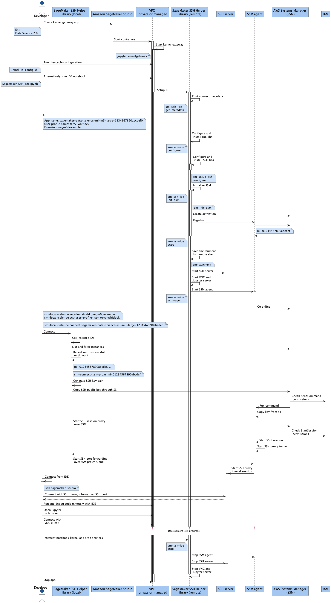

## Flow Diagrams

> *Note*: Below diagrams have to be updated for the latest major release, which introduced the `sm-ssh` tool and made redundant the additional SSH port forwarding tunnel created by `sm-connect-ssh-proxy`.

- [Training job with SSM](#training-job-with-ssm)
- [Training job with SSH](#training-job-with-ssh)
- [Local IDE to SageMaker Studio to with SSH](#local-ide-to-sagemaker-studio-to-with-ssh)

#### Training job with SSM

This flow corresponds to the [Connecting to SageMaker training jobs with SSM](README.md#training) procedure.

#### Training job with SSH

This flow corresponds to the [Remote code execution with PyCharm / VSCode over SSH](README.md#remote-interpreter) procedure.

#### Local IDE to SageMaker Studio to with SSH

This flow corresponds to the [Local IDE integration with SageMaker Studio over SSH for PyCharm / VSCode](README.md#studio) procedure.

