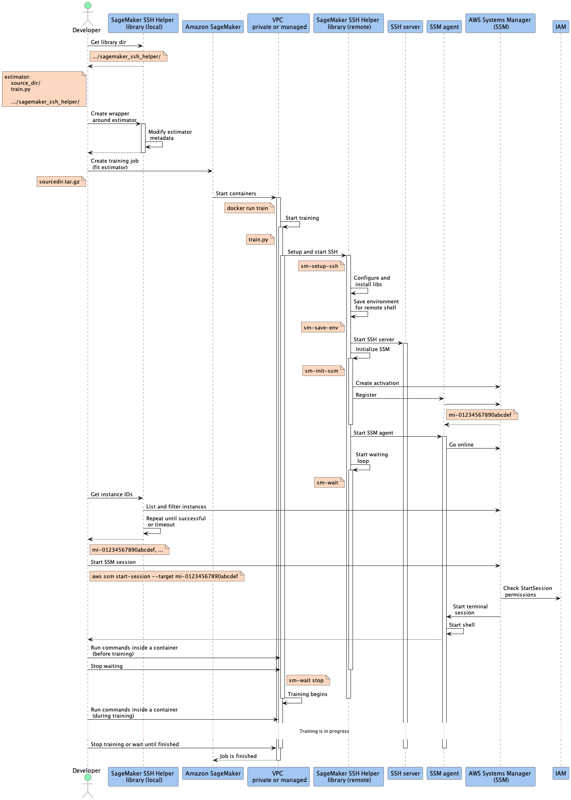
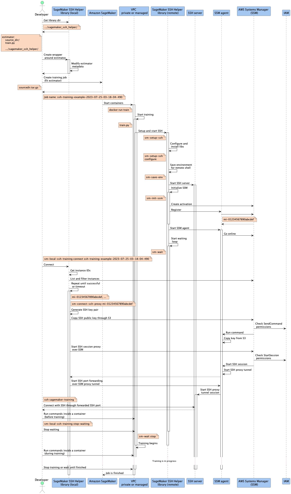

## Flow Diagrams

- [Training job with SSM](#training-job-with-ssm)
- [Training job with SSH](#training-job-with-ssh)

#### Training job with SSM

This flow corresponds to the [Connecting to SageMaker training jobs with SSM](README.md#training) procedure.

#### Training job with SSH

This flow corresponds to the [Remote code execution with PyCharm / VSCode over SSH](README.md#remote-interpreter) procedure.

