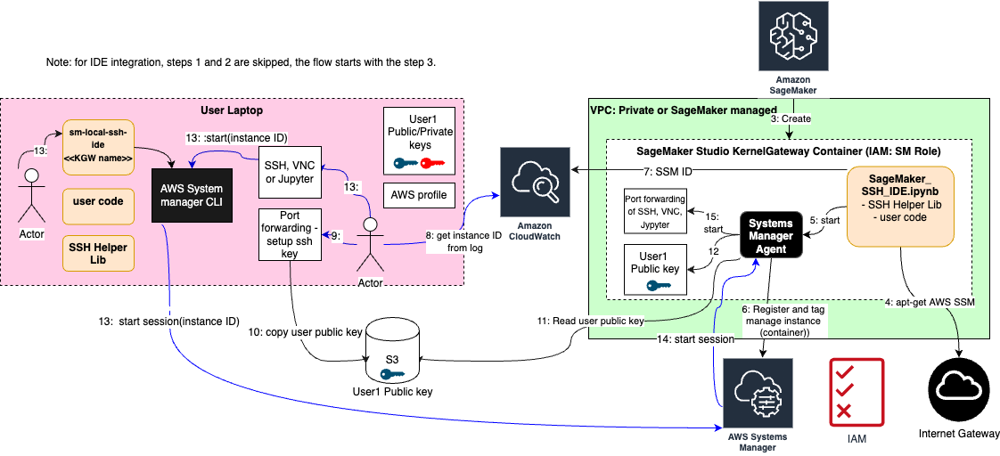

## Flow Diagrams - IDE

#### IDE integration with SageMaker Studio

Also compare with the similar flow diagram for [Training Job](Flows.md).
The major difference is that the flow for IDe starts with the step 3 
(there's no step 1 and 2 to submit a job).

1. (Not applicable)
2. (Not applicable)
3. Amazon SageMaker Studio starts the kernel gateway app.
4. User starts the notebook [SageMaker_SSH_IDE.ipynb](SageMaker_SSH_IDE.ipynb), starting SSH helper, which fetches 
AWS SSM agent and other packages from the Internet, and installs them.
5. SSH Helper starts the SSM agent
6. Through SSM, SSH Helper registers the container as an SSM `managed instance`, and tags it with the DS AWS user/role name.
7. SSH Helper printouts the `managed instance` ID. The log is streamed to CloudWatch Logs.
8. The DS manually/automatically tails the training job logs for the `managed instance` ID.

9-12. Optionally: The DS starts a process to copy over his SSH Public key to the container, needed to set up port forwarding via SSH (e.g., for remote debugging)

13. The DS uses the AWS SSM CLI to start a shell providing the managed instance ID as a parameter.
Optionally, user starts SSM with SSH port forwarding with the helper command `sm-local-ssh-ide connect <<kernel_gateway_name>>`.
14. AWS SSM IAM rules verify that the user is allowed to take this action and that the instance is tagged with the DS's AWS user/role name. Once verified, a session is created with the SSM Agent running in the container.
15. The SSM agent generates a shell by spinning off a new bash shell process.
Optionally, SSH port forwarding starts over SSM connection to let user connect to remote processes over TCP
in both directions.
