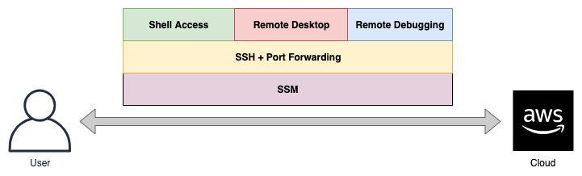
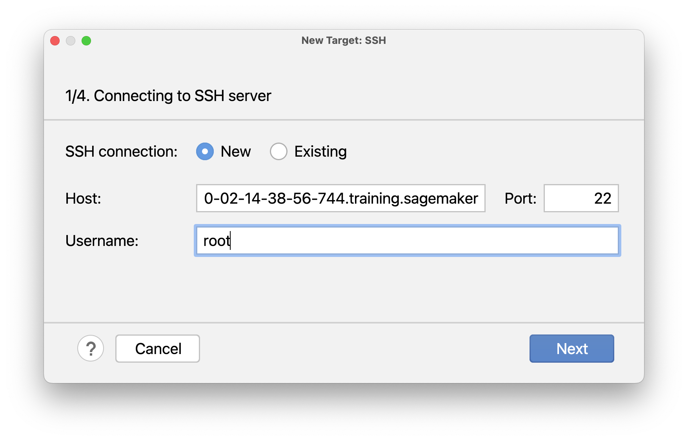
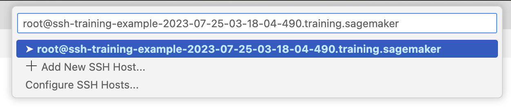
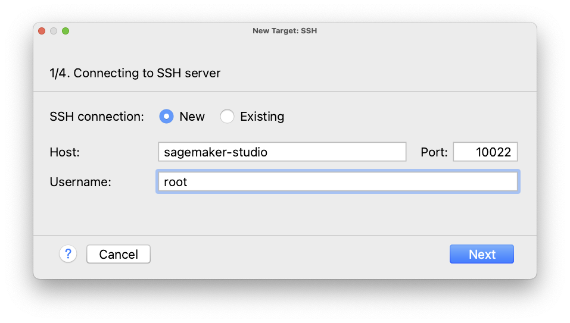
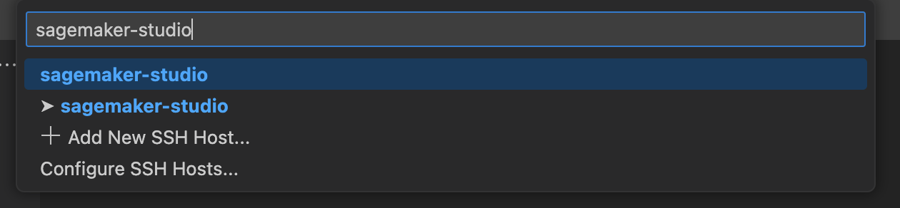

# SageMaker SSH Helper

[](https://pypi.python.org/pypi/sagemaker-ssh-helper)
[](https://pypi.python.org/pypi/sagemaker-ssh-helper)
[](https://github.com/aws-samples/sagemaker-ssh-helper/blob/main/LICENSE)

SageMaker SSH Helper is a library that helps you to securely connect to Amazon SageMaker's training jobs, processing jobs, 
realtime inference endpoints, and SageMaker Studio notebook containers for fast interactive experimentation, 
remote debugging, and advanced troubleshooting.

The two most common scenarios for the library, also known as "SSH into SageMaker", are:
1. A terminal session into a container running in SageMaker to diagnose a stuck training job, use CLI commands 
like nvidia-smi, or iteratively fix and re-execute your training script within seconds. 
2. Remote debugging of a code running in SageMaker from your local favorite IDE like 
PyCharm Professional Edition or Visual Studio Code.

Other scenarios include but not limited to connecting to a remote Jupyter Notebook in SageMaker Studio from your IDE, connect with your browser to a TensorBoard process running in the cloud, or start a VNC session to SageMaker Studio to run GUI apps.  

Also see our [Frequently Asked Questions](FAQ.md), especially if you're using Windows on your local machine.

## How it works
SageMaker SSH helper uses AWS Systems Manager (SSM) Session Manager, to register the SageMaker container in SSM, followed 
by creating an SSM session between your client machine and the SageMaker container. Then you can SSH into SageMaker by creating an SSH connection 
on top of the SSM session, that allows opening a Linux shell, and/or configuring bidirectional SSH port forwarding to 
enable applications like remote development/debugging/desktop, and others.



See detailed architecture diagrams of the complete flow of participating components 
in [Training Diagram](Flows.md), and [IDE integration with SageMaker Studio diagram](Flows_IDE.md).

## Getting started

To get started, your AWS system administrator must set up needed IAM and SSM configuration in your AWS account as shown 
in [Setting up your AWS account with IAM and SSM configuration](IAM_SSM_Setup.md).

> **Note**: This solution is a sample AWS content. You should not use this content in your production accounts, in a production 
> environment or on production or other critical data. If you plan to use the solution in production, please, carefully review it with your security team. 
> You are responsible for testing, securing, and optimizing the sample content 
> as appropriate for production grade use based on your specific business requirements, including any quality control 
practices and standards.


## Use Cases
SageMaker SSH Helper supports a variety of use cases:
- [Connecting to SageMaker training jobs with SSM](#training) - open a shell to a single- or multi-node training job to examine its file systems,
monitor resources, produce thread-dumps for stuck jobs, and interactively run your train script
- [Connecting to SageMaker inference endpoints with SSM](#inference)
- [Connecting to SageMaker batch transform jobs](#batch-transform)
- [Connecting to SageMaker processing jobs](#processing)  
- [Remote debugging with PyCharm Debug Server over SSH](#pycharm-debug-server) - let SageMaker run your code that connects to PyCharm, to start line-by-line debugging with [PyDev.Debugger](https://pypi.org/project/pydevd-pycharm/), a.k.a. pydevd
- [Remote code execution with PyCharm / VSCode over SSH](#remote-interpreter) - let PyCharm run or debug your code line-by-line inside SageMaker container with SSH interpreter
- [Local IDE integration with SageMaker Studio over SSH for PyCharm / VSCode](#studio) - iterate fast on a single node at early stages of development without submitting SageMaker jobs  

If you want to add a new use case or a feature, see [CONTRIBUTING](CONTRIBUTING.md).

## <a name="training"></a>Connecting to SageMaker training jobs with SSM

[](https://aws-blogs-artifacts-public.s3.amazonaws.com/artifacts/ML-4988/SSH_Helper-Shell-To-Training-Jobs.mov)
[Download Demo (.mov)](https://aws-blogs-artifacts-public.s3.amazonaws.com/artifacts/ML-4988/SSH_Helper-Shell-To-Training-Jobs.mov)

### Step 1: Install the library
Before starting the whole procedure, check that both `pip` and `python` commands point to Python version 3.7 or higher with `python --version` command. 

Install the latest stable version of library from the [PyPI repository](https://pypi.org/project/sagemaker-ssh-helper/):

```shell
pip install sagemaker-ssh-helper
```

### Step 2: Modify your start training job code
1. Add import for SSHEstimatorWrapper
2. Add a `dependencies` parameter to the Estimator object.
3. Add an `SSHEstimatorWrapper.create(estimator,...)` call before calling `fit()` and add SageMaker SSH Helper 
as `dependencies`.
4. Add a call to `ssh_wrapper.get_instance_ids()` to get the SSM instance(s) id. We'll use this as the target 
to connect to later on.   

For example:

```python
from sagemaker.pytorch import PyTorch
from sagemaker_ssh_helper.wrapper import SSHEstimatorWrapper  # <--NEW--

role = ...

estimator = PyTorch(entry_point='train.py',
                    source_dir='source_dir/training/',
                    dependencies=[SSHEstimatorWrapper.dependency_dir()],  # <--NEW--
                    role=role,
                    framework_version='1.9.1',
                    py_version='py38',
                    instance_count=1,
                    instance_type='ml.m5.xlarge')

ssh_wrapper = SSHEstimatorWrapper.create(estimator, connection_wait_time_seconds=600)  # <--NEW--

estimator.fit(wait=False)

instance_ids = ssh_wrapper.get_instance_ids()  # <--NEW--
print(f'To connect over SSM run: aws ssm start-session --target {instance_ids[0]}')  # <--NEW--
```

*Note:* `connection_wait_time_seconds` is the amount of time the SSH helper will wait inside SageMaker before it continues normal execution. It's useful for training jobs, when you want to connect before training starts.
If you don't want to wait, set it to 0.

*Note:* If you use distributed training (i.e., `instance_count > 1`), SSH Helper
will start by default only on the first 2 nodes (e.g., on `algo-1` and `algo-2`).
If you want to connect to SSH to other nodes, you can log in to either of these nodes, e.g., `algo-1`,
and then SSH from this node to any other node of the training cluster, e.g., `algo-4`, without running SSH Helper 
on these nodes.

Alternatively, pass the additional parameter `ssh_instance_count` with the desired instance count 
to `SSHEstimatorWrapper.create()`.

*Note:* if you a/ don't use script mode, b/ use basic `Estimator` class and c/ all code is already stored in your Docker container, check the code sample in [the corresponding section of the FAQ](FAQ.md#what-if-i-want-to-train-and-deploy-a-model-as-a-simple-estimator-in-my-own-container-without-passing-entry_point-and-source_dir).


### Step 3: Modify your training script
Add into your `train.py` the following lines at the top:

```python
import sagemaker_ssh_helper
sagemaker_ssh_helper.setup_and_start_ssh()
```

The `setup_and_start_ssh()` will start an SSM agent that will connect the training instance to AWS Systems Manager.

### Step 4: Connect over SSM
Once you launched the job, you'll need to wait, a few minutes, for the SageMaker container to start and the SSM agent
to start successfully. Then you'll need to have the ID of the managed instance. The instance id is prefixed by `mi-` 
and will appear in the job's CloudWatch log like this:

```text
Successfully registered the instance with AWS SSM using Managed instance-id: mi-1234567890abcdef0
``` 

To fetch the instance IDs from the logs in an automated way, call the Python method of `ssh_wrapper`, 
as mentioned in the previous step:

```python
estimator = ...
ssh_wrapper = ...
estimator.fit(wait=False)
instance_ids = ssh_wrapper.get_instance_ids()
```

This method accepts the optional parameter `retry` with the number of retry attempts (default is 60). 
It will retry to get instance IDs until they appear in the CloudWatch logs or number of attempts reached.
The pause between attempts is fixed to 10 seconds, hence by default it will wait not more than 10 minutes.

With the instance id at hand, you will be able to connect to the training container using the command line or the AWS web console:  

A. Connecting using command line:  

1. On the local machine, make sure that you installed the latest [AWS CLI v2](https://docs.aws.amazon.com/cli/latest/userguide/getting-started-install.html) and the [AWS Session Manager CLI plugin](https://docs.aws.amazon.com/systems-manager/latest/userguide/session-manager-working-with-install-plugin.html). Run the following command to perform the installation:

```shell
sm-local-configure
```

*Note:* If you start your training job from SageMaker Studio notebook, and execute the installation command from the image terminal, make sure that Python environment is activated, e.g., with `conda activate base`.

2. Run this command (replace the target value with the instance id for your SageMaker job). Example:
```shell
aws ssm start-session --target mi-1234567890abcdef0
```

B. Connecting using the AWS Web Console:  

  1. In AWS Web Console, navigate to Systems Manager > Fleet Manager.     
  2. Select the node, then Node actions > Start terminal session.

Once connected to the container, you would want to switch to the root user with `sudo su -` command.

#### <a name="cli-commands"></a>Tip: Useful CLI commands

Here are some useful commands to run in a terminal session:  
- `ps xfaww` - Show running tree of processes
- `ps xfawwe` - Show running tree of processes with environment variables 
- `ls -l /opt/ml/input/data` - Show input channels
- `ls -l /opt/ml/code` - Show your training code
- `pip freeze | less` - Show all Python packages installed
- `dpkg -l | less` - Show all system packages installed

#### <a name="gdb"></a>Tip: Generating a thread dump for stuck training jobs
In case your training job is stuck, it can be useful to observe what where its threads are waiting/busy.
This can be done without connecting to a python debugger beforehand.

1. Having connected to the container as root, find the process id (pid) of the training process (assuming it's named `train.py`):
`pgrep --newest -f train.py`  
2. Install GNU debugger:  
`apt-get -y install gdb python3.9-dbg`  
3. Start the GNU debugger with python support:  
`gdb python`  
`source /usr/share/gdb/auto-load/usr/bin/python3.9-dbg-gdb.py`  
4. Connect to the process (replace 361 with your pid):  
`attach 361`  
5. Show C low-level thread dump:  
`info threads`  
6. Show Python high-level thread dump:  
`py-bt`  
7. It might also be useful to observe what system calls the process is making:
`apt-get install strace`
8. Trace the process (replace 361 with your pid):  
`sudo strace -p 361`

#### <a name="cli-commands"></a>Tip: Pipeline automation
If you're looking for the full automation of the pipeline with SSM and SSH, and not only with `get_instance_ids()` method, take a look at the [automation question in the FAQ](FAQ.md#how-do-i-automate-my-pipeline-with-sagemaker-ssh-helper-end-to-end).

## <a name="inference"></a>Connecting to SageMaker inference endpoints with SSM

Adding SageMaker SSH Helper to inference endpoint is similar to training with the following differences.

1. Wrap your model into `SSHModelWrapper` before calling `deploy()` and add SSH Helper to `dependencies`:

```python
from sagemaker_ssh_helper.wrapper import SSHModelWrapper  # <--NEW--

estimator = ...
...
endpoint_name = ... 

model = estimator.create_model(entry_point='inference.py',
                               source_dir='source_dir/inference/',
                               dependencies=[SSHModelWrapper.dependency_dir()])  # <--NEW--

ssh_wrapper = SSHModelWrapper.create(model, connection_wait_time_seconds=0)  # <--NEW--

predictor = model.deploy(initial_instance_count=1,
                         instance_type='ml.m5.xlarge',
                         endpoint_name=endpoint_name)

predicted_value = predictor.predict(data=...)
```

*Note:* For the inference endpoint, which is always up and running, there's not too much value 
in setting `connection_wait_time_seconds`, so it's usually set to `0`.

Similar to training jobs, you can fetch the instance ids for connecting to the endpoint with SSM with 
`ssh_wrapper.get_instance_ids()`.


2. Add the following lines at the top of your `inference.py` script:

```python
import os
import sys
sys.path.append(os.path.join(os.path.dirname(__file__), "lib"))

import sagemaker_ssh_helper
sagemaker_ssh_helper.setup_and_start_ssh()
```

*Note:* adding `lib` dir to Python path is required, because SageMaker inference is putting dependencies 
into the `code/lib` directory, while SageMaker training put libs directly to `code`. 

### Multi-model endpoints

For multi-model endpoints, the setup procedure is slightly different from regular endpoints:

```python
from sagemaker.multidatamodel import MultiDataModel
from sagemaker_ssh_helper.wrapper import SSHModelWrapper, SSHMultiModelWrapper  # <--NEW--

model_data_prefix = "s3://DOC-EXAMPLE-BUCKET/mms/"
model_name = ...
endpoint_name = ...
estimator = ...
...

model = estimator.create_model(entry_point='inference.py',
                               source_dir='source_dir/inference/',
                               dependencies=[SSHModelWrapper.dependency_dir()])  # <--NEW--

mdm = MultiDataModel(
    name=model.name,
    model_data_prefix=model_data_prefix,
    model=model
)

ssh_wrapper = SSHMultiModelWrapper.create(mdm, connection_wait_time_seconds=0)  # <--NEW--

predictor = mdm.deploy(initial_instance_count=1,
                       instance_type='ml.m5.xlarge',
                       endpoint_name=endpoint_name)


mdm.add_model(model_data_source=model.repacked_model_data, model_data_path=model_name)

predicted_value = predictor.predict(data=..., target_model=model_name)
```

**Important:** Make sure that you're passing to `add_model()` the model ready for deployment with dependencies located at `model.repacked_model_data`,
not the `estimator.model_data` that points to the trained model artifact. To obtain model suitable for inference, you might want to deploy first your model to a temporary single-node endpoint, so that SageMaker Python SDK takes care of repacking the model.

Also note that SageMaker SSH Helper will be lazy loaded together with your model upon the first prediction request.
So you should try to connect to the multi-model endpoint only after calling `predict()`.

The `inference.py` script is the same as for regular endpoints.

If you are using PyTorch containers, make sure you select the latest versions, 
e.g. 1.12, 1.11, 1.10 (1.10.2), 1.9 (1.9.1).
This code might not work if you use PyTorch 1.8, 1.7 or 1.6.

*Note:* if you're packing your models manually and don't pass the `model` object to the `MultiDataModel` constructor, i.e., pass only the `image_uri`, see corresponding sample code in the [FAQ.md](FAQ.md#what-if-i-want-to-deploy-a-multi-data-model-without-passing-a-reference-to-a-model-object-only-with-image_uri).

## <a name="batch-transform"></a>Connecting to SageMaker batch transform jobs

For batch transform jobs, you need to use both `SSHModelWrapper` and `SSHTransformerWrapper`, 
as in the following example:

```python
from sagemaker_ssh_helper.wrapper import SSHModelWrapper, SSHTransformerWrapper  # <--NEW--

sagemaker_session = ...
bucket = ...
estimator = ...
...

model = estimator.create_model(entry_point='inference.py',
                               source_dir='source_dir/inference/',
                               dependencies=[SSHModelWrapper.dependency_dir()])  # <--NEW--

transformer_input = sagemaker_session.upload_data(path='data/batch_transform/input',
                                                  bucket=bucket,
                                                  key_prefix='batch-transform/input')

transformer_output = f"s3://{bucket}/batch-transform/output"

ssh_model_wrapper = SSHModelWrapper.create(model, connection_wait_time_seconds=600)  # <--NEW--

transformer = model.transformer(instance_count=1,
                                instance_type="ml.m5.xlarge",
                                accept='text/csv',
                                strategy='SingleRecord',
                                assemble_with='Line',
                                output_path=transformer_output)

ssh_transformer_wrapper = SSHTransformerWrapper.create(transformer, ssh_model_wrapper)  # <--NEW--

transformer.transform(data=transformer_input,
                      content_type='text/csv',
                      split_type='Line',
                      join_source="Input",
                      wait=False)
```
The `inference.py` script is the same as for regular endpoints.

## <a name="processing"></a>Connecting to SageMaker processing jobs

SageMaker SSH Helper supports both Script Processors and Framework processors and setup procedure is similar 
to training jobs and inference endpoints.

#### A. Framework processors

The code to set up a framework processor (e.g. PyTorch) is the following:

```python
from sagemaker.pytorch import PyTorchProcessor
from sagemaker_ssh_helper.wrapper import SSHProcessorWrapper  # <--NEW--

role = ...

torch_processor = PyTorchProcessor(
    base_job_name='ssh-pytorch-processing',
    framework_version='1.9.1',
    py_version='py38',
    role=role,
    instance_count=1,
    instance_type="ml.m5.xlarge"
)

ssh_wrapper = SSHProcessorWrapper.create(torch_processor, connection_wait_time_seconds=600)  # <--NEW--

torch_processor.run(
    source_dir="source_dir/processing/",
    dependencies=[SSHProcessorWrapper.dependency_dir()],  # <--NEW--
    code="process_framework.py"
)
```

Also add the following lines at the top of `process_framework.py`:

```python
import sagemaker_ssh_helper
sagemaker_ssh_helper.setup_and_start_ssh()
```

#### B. Script Processors

The code to set up a script processor (e.g. PySpark) is the following:

```python
from sagemaker.spark import PySparkProcessor
from sagemaker_ssh_helper.wrapper import SSHProcessorWrapper  # <--NEW--

role = ...

spark_processor = PySparkProcessor(
    base_job_name='ssh-spark-processing',
    framework_version="3.0",
    role=role,
    instance_count=1,
    instance_type="ml.m5.xlarge"
)

ssh_wrapper = SSHProcessorWrapper.create(spark_processor, connection_wait_time_seconds=600)  # <--NEW--

spark_processor.run(
    submit_app="source_dir/processing/process.py",
    inputs=[ssh_wrapper.augmented_input()]  # <--NEW--
)
```

Also add the following lines at the top of `process.py`:

```python
import sys
sys.path.append("/opt/ml/processing/input/")

import sagemaker_ssh_helper
sagemaker_ssh_helper.setup_and_start_ssh()
```

## <a name="pycharm-debug-server"></a>Remote debugging with PyCharm Debug Server over SSH

This procedure uses PyCharm's Professional feature: [Remote debugging with the Python remote debug server configuration](https://www.jetbrains.com/help/pycharm/remote-debugging-with-product.html#remote-debug-config)

1. On the local machine, make sure that you installed the latest [AWS CLI v2](https://docs.aws.amazon.com/cli/latest/userguide/getting-started-install.html) and the [AWS Session Manager CLI plugin](https://docs.aws.amazon.com/systems-manager/latest/userguide/session-manager-working-with-install-plugin.html). Run the following command to perform the installation:

```shell
sm-local-configure
```

2. In PyCharm, go to the Run/Debug Configurations (Run -> Edit Configurations...), add a new Python Debug Server.
Choose the fixed port, e. g. `12345`.

3. Take the correct version of `pydevd-pycharm` package from the configuration window 
and install it either through `requirements.txt` or by calling `pip` from your source code.

4. Add commands to connect to the Debug Server to your code **after** the `setup_and_start_ssh()` (e.g., into [a training script](https://github.com/aws-samples/sagemaker-ssh-helper/blob/main/tests/source_dir/training_debug/train_debug.py) that you submit as an entry point for a training job):
```python
import pydevd_pycharm
pydevd_pycharm.settrace('localhost', port=12345, stdoutToServer=True, stderrToServer=True, suspend=True)
```
*Tip*: Check the argument's description in [the library source code](https://github.com/JetBrains/intellij-community/blob/dee787ef05d1187a71b7667652f6b25f3f573a1b/python/helpers/pydev/pydevd.py#L1663).

5. Set extra breakpoints in your code with PyCharm, if needed
6. Start the Debug Server in PyCharm
7. Submit your code to SageMaker with SSH Helper as described in previous sections.
Make sure you allow enough time for manually setting up the connection
(do not set `connection_wait_time_seconds` to 0, recommended minimum value is 600, i.e. 10 minutes).
Don't worry to set it to higher values, e.g. to 30 min, because you will be able to terminate the waiting loop 
once you connect.

8. Start the port forwarding script once SSH helper connects to SSM and starts waiting inside the training job:
```shell
sm-local-ssh-training connect <<training_job_name>>
```
It will reverse-forward the remote debugger port `12345` to your local machine's Debug Server port.
The local port `11022` will be connected to the remote SSH server port, 
to allow you easily connect with SSH from command line.  

> *Note:* Before running this command make sure that AWS CLI is configured to access the account with `aws s3 ls` and your default region is set with `aws configure` command. Your Python's `<path-to-venv>/bin/` directory should be in the `$PATH`, otherwise you will get a *"command not found"* error.

*Tip:* If you want to connect processing, batch transform jor or to an inference endpoint with SSH, use
`sm-local-ssh-processing`, `sm-local-ssh-transform` or `sm-local-ssh-inference` scripts respectively.

Feel free to use the scripts as templates. Clone and customize them, if you want to change the ports.

9. Add the following configuration to `~/.ssh/config`:

```text
Host sagemaker-training
  HostName localhost
  IdentityFile ~/.ssh/sagemaker-ssh-gw
  Port 11022
  User root
```

*Note:* The SSH key specified as `IdentityFile` is automatically generated on your local machine every time when you run `sm-local-ssh-training` command from the step 8.

While the `sm-local-ssh-training` script is running, you *may* connect with SSH to the specified local port (but it's not needed for PyCharm Debugger to work):

```shell
ssh sagemaker-training
```

*Tip:* If you log in to the node with SSH and don't see a `sm-wait` process, the training script has already started 
and failed to connect to the PyCharm Debug Server, so you need to increase the `connection_wait_time_seconds`, 
otherwise the debugger will miss your breakpoints.

*Tip:* If you don't want `ssh` command to complain about remote host keys, when you switch to a different node,
consider adding this two options to the command: `-o StrictHostKeyChecking=no -o UserKnownHostsFile=/dev/null`.

10. Stop the waiting loop – connect to the instance and terminate the loop.

As already mentioned, make sure you've put enough timeout to allow the port forwarding script set up a tunnel 
before execution of your script continues.

You can use the following CLI command from your local machine to stop the waiting loop (the `sm-wait` remote process):
```shell
sm-local-ssh-training stop-waiting
```

Alternatively, if logged to the remote container already, run the `pkill` command from its shell (under `root`):
```text
pkill sm-wait
```

11. After you stop the waiting loop, your code will continue running and will connect to your PyCharm Debug Server.

If everything is set up correctly, and you followed all the steps, PyCharm will stop at your breakpoint, highlight the line and wait for your input. Debug Server window will say “connected”. You can now press, for example, F8 to "Step Over" the code line or F7 to "Step Into" the code line.

## <a name="remote-interpreter"></a>Remote code execution with PyCharm / VSCode over SSH

Follow the steps from the section [Remote debugging with PyCharm Debug Server](#pycharm-debug-server), but skip the steps 2, 3, 4 and 11 that configure Remote Debug Server.

Instead, you need to configure the remote Python interpreter. Use `sagemaker-training` as the host name in an IDE dialog. 

 * [Instructions for PyCharm](https://www.jetbrains.com/help/pycharm/remote-debugging-with-product.html#remote-interpreter)

In PyCharm, use `11022` as the port and `root` as the user.



 * [Instructions for VSCode](https://code.visualstudio.com/docs/remote/ssh)



Note, that if you stop the waiting loop, SageMaker will run your training script only once, and you will be able to execute additional code from local machine from PyCharm only while your script is running. Once the script finishes, you will need to submit another training job and repeat the procedure again.

But there's a useful trick: submit a dummy script `train_placeholder.py` with the infinite loop, and while this loop will be running, you can 
run your real training script again and again with the remote interpreter.
Setting `max_run` parameter of the estimator is highly recommended in this case.

The dummy script may look like this:

```python
import time

import sagemaker_ssh_helper
sagemaker_ssh_helper.setup_and_start_ssh()

while True:
    time.sleep(10)
```

Make also sure that you're aware of [SageMaker Managed Warm Pools](https://docs.aws.amazon.com/sagemaker/latest/dg/train-warm-pools.html) 
feature, which is also helpful in such a scenario.

*Pro Tip:* Note that you can debug your code line by line in this scenario, too! See [the tutorial in PyCharm documentation](https://www.jetbrains.com/help/pycharm/debugging-your-first-python-application.html#debug). Some users might prefer this option instead of using Debug Server as a simpler alternative.


## <a name="studio"></a>Local IDE integration with SageMaker Studio over SSH for PyCharm / VSCode

[](https://aws-blogs-artifacts-public.s3.amazonaws.com/artifacts/ML-4988/SSH_Helper-Remote-IDE.mov)
[Download Demo (.mov)](https://aws-blogs-artifacts-public.s3.amazonaws.com/artifacts/ML-4988/SSH_Helper-Remote-IDE.mov)

Follow the next steps for your local IDE integration with SageMaker Studio:

1. Copy [SageMaker_SSH_IDE.ipynb](SageMaker_SSH_IDE.ipynb) into SageMaker Studio and run it.

*Tip:* Alternatively, instead of using `SageMaker_SSH_IDE.ipynb`, attach to a domain the KernelGateway lifecycle config script [kernel-lc-config.sh](kernel-lc-config.sh) 
(you may need to ask your administrator to do this).
Once configured, from the Launcher choose the environment, puck up the lifecycle script and choose 
'Open image terminal' (so, you don't even need to create a notebook).

2. On the local machine, install the library: 

```
pip install sagemaker-ssh-helper
```

3. Make sure that you installed the latest [AWS CLI v2](https://docs.aws.amazon.com/cli/latest/userguide/getting-started-install.html) and the [AWS Session Manager CLI plugin](https://docs.aws.amazon.com/systems-manager/latest/userguide/session-manager-working-with-install-plugin.html). Run the following command to perform the installation:

```shell
sm-local-configure
```

4. Start SSH tunnel and port forwarding from a terminal session as follows:

```shell
sm-local-ssh-ide connect <<kernel_gateway_app_name>>
```

The parameter <<kernel_gateway_app_name>> is either taken from SageMaker Studio when you run notebook [SageMaker_SSH_IDE.ipynb](SageMaker_SSH_IDE.ipynb), 
or from the image terminal as a `hostname` output, or you can find it in the list of running apps in AWS Console under Amazon SageMaker -> Control Panel -> User Details.
It looks like this: `sagemaker-data-science-ml-m5-large-1234567890abcdef0`.

The local port `10022` will be connected to the remote SSH server port, to let you connect with SSH from IDE.  
In addition, the local port `8889` will be connected to remote Jupyter notebook port, the port `5901` to the remote VNC server 
and optionally the remote port `443` will be connected to your local PyCharm license server address.

> *Note:* Before running this command make sure that AWS CLI is configured to access the account with `aws s3 ls` and your default region is set with `aws configure` command. Your Python's `<path-to-venv>/bin/` directory should be in the `$PATH`, otherwise you will get a *"command not found"* error.

Feel free to use the script as a template. Clone and customize it, if you want to change the ports and hosts.


5. Add the following configuration to `~/.ssh/config`:

```text
Host sagemaker-studio
  HostName localhost
  IdentityFile ~/.ssh/sagemaker-ssh-gw
  Port 10022
  User root
```

*Note:* The SSH key specified as `IdentityFile` is automatically generated on your local machine every time when you run `sm-local-ssh-ide` command from the step 4.

Before moving to the next step, you can optionally check from your local machine that connection is working by running the SSH command in command line:

```shell
ssh sagemaker-studio
```


6. Connect local PyCharm or VSCode with remote Python interpreter by using `sagemaker-studio` as the remote SSH host.

 * [Instructions for SSH in PyCharm](https://www.jetbrains.com/help/pycharm/remote-debugging-with-product.html#remote-interpreter)

In PyCharm, use `11022` as the port and `root` as the user.



 * [Instructions for SSH in VSCode](https://code.visualstudio.com/docs/remote/ssh)



*Tip (PyCharm):* When you configure Python interpreter in PyCharm, it's recommended to configure [the path mapping](https://www.jetbrains.com/help/pycharm/deployment-mappings-tab.htm) (*"Sync folders"* deployment option) for you project to point into `/root/project_name` instead of default `/tmp/pycharm_project_123`. This is how you will be able to see your project in SageMaker Studio and PyCharm will automatically sync your local dir to the remote dir. 

*Tip (PyCharm):* Also instead of creating a new venv, point the Python interpreter to the existing location. 
You can find this location by running a cell with `import sys; sys.executable` command in a SageMaker Studio notebook. You will get something like `/opt/conda/bin/python`.

Now with PyCharm or VSCode you can run and debug the code remotely inside the kernel gateway app.

You can also configure a remote Jupyter Server as 
http://127.0.0.1:8889/?token=<<your_token>>.

You will find the full URL with remote token in 
the [SageMaker_SSH_IDE.ipynb](SageMaker_SSH_IDE.ipynb) notebook in the output after running the cell
with `sm-ssh-ide start` command. If you use lifecycle configuration, run `tail /tmp/jupyter-notebook.log` from the image terminal to find the Jupyter Server URL.

 * [Instructions for remote Jupyter notebooks in PyCharm](https://www.jetbrains.com/help/pycharm/configuring-jupyter-notebook.html#configure-server)
 * [Instructions for remote Jupyter notebooks in VSCode](https://code.visualstudio.com/docs/datascience/jupyter-notebooks#_connect-to-a-remote-jupyter-server) (don't forget to switch kernel to remote after configuring the remote server).

You can also start the VNC session to [vnc://localhost:5901](vnc://localhost:5901) (e.g. on macOS with Screen Sharing app)
and run IDE or any other GUI app on the remote desktop instead of your local machine. For example, you can run `jupyter qtconsole --existing` command to connect to already running SageMaker Studio kernel with the [Jupyter QT app](https://qtconsole.readthedocs.io/en/stable/index.html), instead of using the notebook web UI.

7. If you want to switch to another [kernel](https://docs.aws.amazon.com/sagemaker/latest/dg/notebooks-run-and-manage-change-image.html) 
or [instance](https://docs.aws.amazon.com/sagemaker/latest/dg/notebooks-run-and-manage-switch-instance-type.html), feel free to do so from SageMaker Studio UI and re-run
[SageMaker_SSH_IDE.ipynb](SageMaker_SSH_IDE.ipynb).

Keep in mind that in this case the previous kernel will stop and SSM agent will stop, too.
To allow multiple kernel and instances to be up and running with SageMaker SSH Helper and SSM agent,
duplicate the notebook and give it a different name, e.g. `SageMaker_SSH_IDE-PyTorch.ipynb`.
In this case you'll be able to keep two environments in parallel. To switch between them,
you will only need to re-run `sm-local-ssh-ide` command on your local machine.

If you're using lifecycle configuration script, just start another image terminal with different environment settings 
from Launcher.

8. Don't forget to [shut down](https://docs.aws.amazon.com/sagemaker/latest/dg/notebooks-run-and-manage-shut-down.html)
SageMaker Studio resources, if you don't need them anymore, e.g., launched notebooks, terminals, apps and instances.

See the [troubleshooting section of the FAQ](FAQ.md#troubleshooting), if something doesn't work as you expect.
