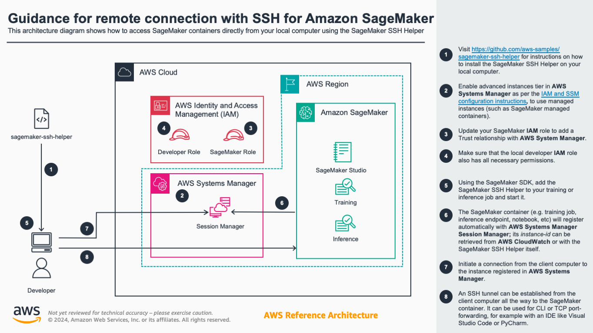

# SageMaker SSH Helper

[](https://pypi.python.org/pypi/sagemaker-ssh-helper)
[](https://pypi.python.org/pypi/sagemaker-ssh-helper)
[](https://github.com/aws-samples/sagemaker-ssh-helper/blob/main/LICENSE)

SageMaker SSH Helper is the "army-knife" library that helps you to securely connect to Amazon SageMaker training jobs, processing jobs, batch inference jobs
and realtime inference endpoints as well as SageMaker Studio Notebooks and SageMaker Notebook Instances for fast interactive experimentation, 
remote debugging, and advanced troubleshooting.

Three most common tasks that motivated to create the library, sometimes referred as "SSH into SageMaker", are:
1. A terminal session into a container running in SageMaker to diagnose a stuck training job, use CLI commands 
like nvidia-smi and neuron-ls, or iteratively fix and re-execute your training script within seconds. 
2. Remote debugging of a code running in SageMaker from your local favorite IDE like 
PyCharm Professional Edition or Visual Studio Code.
3. Port forwarding to access auxiliary tools running inside SageMaker, e.g., Dask dashboard, Streamlit apps, TensorBoard or Spark Web UI.


Other tasks include but not limited to connecting to a remote Jupyter Notebook in SageMaker Studio from your IDE, or starting a VNC session to SageMaker Studio to run GUI apps.  


## How it works
SageMaker SSH helper uses AWS Systems Manager (SSM) Session Manager, to register a SageMaker container in SSM, followed by creating a session between your client machine and the Session Manager service. From there, you can "SSH into SageMaker" by creating an SSH (Secure Shell) connection on top of the SSM sessions, that allows opening a Linux shell and configuring bidirectional SSH port forwarding to run applications like remote development, debugging, desktop GUI, and others.



If you want to understand deeper how both the SageMaker service and the SageMaker SSH Helper library work, check the [Flow Diagrams](Flow_Diagrams.md) of the common use cases and carefully read all sections of the documentation.

Make sure you also looked at our [Frequently Asked Questions](FAQ.md), especially at the [troubleshooting section](FAQ.md#troubleshooting), as well as at the existing both open and resolved [issues](https://github.com/aws-samples/sagemaker-ssh-helper/issues?q=is%3Aissue).

## Getting started

To get started, your AWS system administrator must configure IAM and SSM in your AWS account as shown 
in [Setting up your AWS account with IAM and SSM configuration](IAM_SSM_Setup.md).

> **Note: This repository is a sample AWS content.** You should not use the sample content in your production accounts, in a production 
> environment or on production or other critical data. If you plan to use the content in production, please, carefully review it with your security team. 
> You are responsible for testing, securing, and optimizing the sample content 
> as appropriate for production grade use based on your specific business requirements, including any quality control 
practices and standards.

Also make sure that the documentation you are reading corresponds the version you are installing. The best way to do that is to access the repository from the [Releases](https://github.com/aws-samples/sagemaker-ssh-helper/releases) page. In this case the URL in the address bar should look like [sagemaker-ssh-helper/tree/vX.Y.Z](https://github.com/aws-samples/sagemaker-ssh-helper/tree/vX.Y.Z).

## Costs

You are responsible for the cost of the AWS services used while running this guidance. If you haven't used Systems Manager Session Manager in your AWS account before, it will be the only additional cost associated with using SageMaker SSH Helper. The costs of [SageMaker resources](https://aws.amazon.com/sagemaker/pricing/) do not change and you pay only for the resources that you use.  

As explained in the [IAM and SSM configuration](IAM_SSM_Setup.md), you need to enable Advanced instances tier in Systems Manager because this is the only way to enable Session Manager and access remote instances interactively with SSM and SSH. As of June 2024, the advanced instances tier comes at [a small fee](https://aws.amazon.com/systems-manager/pricing/#Session_Manager), which is $0.00695 per advanced on-premises instance per hour. 

See [the sample cost breakdown table](Sample_Costs.md) for SageMaker and Systems Manager for AWS account that runs the routine [CI/CD tests](tests/) for this guidance in the EU (Ireland) Region.

We recommend creating a [Budget](https://docs.aws.amazon.com/cost-management/latest/userguide/budgets-managing-costs.html) through [AWS Cost Explorer](https://aws.amazon.com/aws-cost-management/aws-cost-explorer/) to help manage costs. Prices are subject to change. For full details, refer to the pricing webpage for each AWS service used in this guidance.


## Use Cases
SageMaker SSH Helper supports a variety of use cases:
- [Connecting to SageMaker training jobs with SSM](#training) - shell access only, open a shell to a single- or multi-node training job to examine its file systems, monitor resources, produce thread-dumps for stuck jobs, and interactively run your train script
  - [Connecting to SageMaker inference endpoints with SSM](#inference)
  - [Connecting to SageMaker batch transform jobs](#batch-transform)
  - [Connecting to SageMaker processing jobs](#processing)  
- [Forwarding TCP ports over SSH tunnel](#port-forwarding) - intermediate layer for debugging and remote code execution, enables through SSH and port forwarding the access to remote apps like Dask, Streamlit or Jupyter Notebook
  - [sm-ssh](#sm-ssh) - SageMaker SSH Helper CLI, introduced in v2.2
  - [~/.ssh/config](#sshconfig) - to use `ssh` CLI command instead of `sm-ssh`
- [Remote code execution with PyCharm / VSCode over SSH](#remote-interpreter) - debugging and remote code execution, lets your IDE run or debug your code line-by-line inside SageMaker container with SSH interpreter, e.g. inside a SageMaker training job
  - [Remote debugging with PyCharm Debug Server over SSH](#pycharm-debug-server) - debugging and remote code execution, uses debug server, lets SageMaker run your code that connects to PyCharm with a callback, to start line-by-line debugging with [PyDev.Debugger](https://pypi.org/project/pydevd-pycharm/), a.k.a. pydevd
- [Local IDE integration with SageMaker Studio over SSH for PyCharm / VSCode](#studio) - debugging and remote code execution in SageMaker Studio, iterate fast on a single node at early stages of development without submitting SageMaker jobs
  - [Support of SageMaker Notebook Instances](FAQ.md#are-sagemaker-notebook-instances-supported) - see FAQ
- [Web VNC](#web-vnc) - run virtually any IDE or GUI tool in a browser though [AWS Jupyter Proxy](https://github.com/aws/aws-jupyter-proxy) extension and VNC remote desktop protocol

**Pro Tip**: While multiple use cases allow debugging and remote code execution, the typical development journey looks as follows: (1) you start developing and running code in the IDE on your [local machine](https://aws.amazon.com/blogs/machine-learning/run-your-tensorflow-job-on-amazon-sagemaker-with-a-pycharm-ide/), then (2) you connect the IDE to [SageMaker Studio](https://docs.aws.amazon.com/sagemaker/latest/dg/studio.html) with SageMaker SSH Helper to test and troubleshoot it on the remote instance, then (3) you integrate your code with SageMaker and run it as a [training](https://docs.aws.amazon.com/sagemaker/latest/dg/train-model.html), [processing](https://docs.aws.amazon.com/sagemaker/latest/dg/processing-job.html) or [inference](https://docs.aws.amazon.com/sagemaker/latest/dg/deploy-model.html) job, using SageMaker SSH Helper if needed, and finally (4) assemble jobs into MLOps pipelines with [SageMaker Projects](https://docs.aws.amazon.com/sagemaker/latest/dg/sagemaker-projects.html), to be deployed into multi-account structure on top of (5) the [secure enterprise ML platform](https://docs.aws.amazon.com/whitepapers/latest/build-secure-enterprise-ml-platform/build-secure-enterprise-ml-platform.html).

If you want to add a new use case or a feature, see [CONTRIBUTING](CONTRIBUTING.md).


## <a name="training"></a>Connecting to SageMaker training jobs with SSM

[](https://aws-blogs-artifacts-public.s3.amazonaws.com/artifacts/ML-4988/SSH_Helper-Shell-To-Training-Jobs.mov)
[Download Demo (.mov)](https://aws-blogs-artifacts-public.s3.amazonaws.com/artifacts/ML-4988/SSH_Helper-Shell-To-Training-Jobs.mov)

> **Note**: This demo is recorded with a previous version of SSH Helper and may be not up-to-date with the recent features. Check the below documentation for the most up-to-date steps.

### Step 1: Install the library
Before starting the whole procedure, check that both `pip` and `python` commands point to Python version 3.8 or higher with `python --version` command. Check all supported Python versions [in the PyPI repo](https://pypi.org/project/sagemaker-ssh-helper/) under "Programming Language" list.

> **Important:** Make sure you read the "Getting started" section and didn't skip the steps from [Setting up your AWS account with IAM and SSM configuration](IAM_SSM_Setup.md).

Install the latest stable version of library from the [PyPI repository](https://pypi.org/project/sagemaker-ssh-helper/):

```shell
pip install sagemaker-ssh-helper
```
**Caution:** It's always recommended to install the library into a Python venv, not into the system env. If you want to use later the SSH plugins of your IDE that will use the system env and system Python, you should add the venv into the system PATH, as described in the section [Remote code execution with PyCharm / VSCode over SSH](#remote-interpreter).

If you're working on Windows, see [FAQ](FAQ.md#is-windows-supported).

### Step 2: Modify your start training job code
1. Add import for `SSHEstimatorWrapper`
2. Add a `dependencies` parameter to the `Estimator` object constructor. Alternatively, instead of `dependencies` parameter, put `sagemaker_ssh_helper` into `source_dir/training/requirements.txt`.
3. Add an `SSHEstimatorWrapper.create(estimator,...)` call before calling `fit()`.
4. Add a call to `ssh_wrapper.print_ssh_info()` or `ssh_wrapper.get_instance_ids()` to get the SSM instance(s) id. You'll use this information
to connect to the instance later on.   

In a nutshell:

```python
import logging
from sagemaker.pytorch import PyTorch
from sagemaker_ssh_helper.wrapper import SSHEstimatorWrapper  # <--NEW--

role = ...

estimator = PyTorch(
    entry_point='train.py',
    source_dir='source_dir/training/',
    dependencies=[SSHEstimatorWrapper.dependency_dir()],  # <--NEW--
    role=role,
    framework_version='1.9.1',
    py_version='py38',
    instance_count=1,
    instance_type='ml.m5.xlarge'
)

ssh_wrapper = SSHEstimatorWrapper.create(estimator, connection_wait_time_seconds=600)  # <--NEW--

estimator.fit(wait=False)

ssh_wrapper.print_ssh_info()  # <--NEW-- 
```

The `connection_wait_time_seconds` is the amount of time the SSH Helper will wait inside SageMaker before it continues the job execution. It's useful for training jobs, when you want to connect before training starts.
If you don't want the job to wait and start training as soon as the job starts, set it to `0`.

As an example, here's the full working code from a unit test: [test_end_to_end.py#L31-L56](https://github.com/aws-samples/sagemaker-ssh-helper/blob/v2.1.0/tests/test_end_to_end.py#L31-L56) . The method `start_ssm_connection_and_continue(port_number)` will connect to the instance through API, terminate the waiting loop and start training (useful for automation).

If you configured distributed training (i.e., `instance_count` is more than one), SSH Helper
will start by default only on the first two nodes (i.e., on `algo-1` and `algo-2`).
If you want to connect with SSH to other nodes, you can log in to either of these nodes, e.g., `algo-2`,
and then SSH from this node to any other node of the training cluster, e.g., `algo-4`, without running SSH Helper 
on these nodes, e.g., inside the pre-build SageMaker framework containers like PyTorch training container just run `ssh algo-4` from the shell.

Alternatively, for distributed training, pass the additional parameter `ssh_instance_count` with the desired instance count 
to `SSHEstimatorWrapper.create()`, e.g., `SSHEstimatorWrapper.create(..., ssh_instance_count=3)`

*Note:* if you a/ don't use script mode, b/ use basic `Estimator` class and c/ all code is already stored in your Docker container, check the code sample in [the corresponding section of the FAQ](FAQ.md#what-if-i-want-to-train-and-deploy-a-model-as-a-simple-estimator-in-my-own-container-without-passing-entry_point-and-source_dir).

Don't run the modified code yet, see the next step.

### Step 3: Modify your training script

```python
import sagemaker_ssh_helper
sagemaker_ssh_helper.setup_and_start_ssh()
```

The `setup_and_start_ssh()` will start an SSM Agent that will connect the training instance to AWS Systems Manager.

See the [train.py](https://github.com/aws-samples/sagemaker-ssh-helper/blob/v2.1.0/tests/source_dir/training/train.py) from the corresponding unit test, as a full working code sample.

### Step 4: Connect over SSM
Once you launched the job, you'll need to wait, a few minutes, for the SageMaker container to start and the SSM Agent
to start successfully. Then you'll need to have the ID of the managed instance. The instance id is prefixed by `mi-` 
and will appear in the job's CloudWatch log like this:

```text
Successfully registered the instance with AWS SSM using Managed instance-id: mi-1234567890abcdef0
``` 

To fetch the instance IDs in an automated way without looking into the logs, you can call the Python method `ssh_wrapper.get_instance_ids()` or `ssh_wrapper.print_ssh_info()`, as mentioned in the step 1:

```python
estimator = ...
ssh_wrapper = ...
estimator.fit(wait=False)
instance_ids = ssh_wrapper.get_instance_ids(timeout_in_sec=900)
```

The method `get_instance_ids()` accepts the optional parameter `timeout_in_sec` (default is 900, i.e., 15 minutes). 
If timeout is not 0, it will retry attempts to get instance IDs every 10 seconds.

With the instance ID at hand, you will be able to connect to the training container using the command line or the AWS web console. 

Method A. Connecting using command line:  

1. On the local machine, make sure that you installed the latest [AWS CLI v2](https://docs.aws.amazon.com/cli/latest/userguide/getting-started-install.html) and the [AWS Session Manager CLI plugin](https://docs.aws.amazon.com/systems-manager/latest/userguide/session-manager-working-with-install-plugin.html). Run the following command to perform the installation:

```shell
sm-local-configure
```

2. Run this command (replace the target value with the instance id for your SageMaker job). Example:
```shell
aws ssm start-session --target mi-1234567890abcdef0
```

**Note:** Recently SageMaker has introduced [the native way to connect to training jobs with SSM](https://docs.aws.amazon.com/sagemaker/latest/dg/train-remote-debugging.html). 

Method B. Connecting using the AWS Web Console:  

  1. In AWS Web Console, navigate to Systems Manager > Fleet Manager.     
  2. Select the node, then Node actions > Start terminal session.

Once connected to the container, you might want to switch to the root user with `sudo su -` command.

Method C. Connecting with SSH and port forwarding:

This method uses `sm-ssh connect` command and described in more details in the section [sm-ssh](#sm-ssh).

Method D. Connecting from SageMaker Studio

See the corresponding step [Connecting from SageMaker Studio](IAM_SSM_Setup.md#4-optional-connecting-from-sagemaker-studio) in IAM / SSM configuration section. Follow the same steps as in the Method A for the local machine, but run them inside SageMaker Studio. If you run the commands from SageMaker Studio image terminal, make sure that your Python environment is activated, e.g., with `conda activate base`.


#### <a name="cli-commands"></a>Tip: Useful CLI commands

Here are some useful commands to run in a terminal session:  
- `ps xfaww` - Show running tree of processes
- `ps xfawwe` - Show running tree of processes with environment variables 
- `ls -l /opt/ml/input/data` - Show input channels
- `ls -l /opt/ml/code` - Show your training code
- `pip freeze | less` - Show all Python packages installed
- `dpkg -l | less` - Show all system packages installed

#### <a name="gdb"></a>Tip: Generating a thread dump for stuck training jobs
In case your training job is stuck, it can be useful to observe what where its threads are waiting/busy.
This can be done without connecting to a python debugger beforehand.

1. Having connected to the container as root, find the process id (pid) of the training process (assuming it's named `train.py`):
`pgrep --newest -f train.py`  
2. Install GNU debugger:  
`apt-get -y install gdb python3.9-dbg`  
3. Start the GNU debugger with python support:  
`gdb python`  
`source /usr/share/gdb/auto-load/usr/bin/python3.9-dbg-gdb.py`  
4. Connect to the process (replace 361 with your pid):  
`attach 361`  
5. Show C low-level thread dump:  
`info threads`  
6. Show Python high-level thread dump:  
`py-bt`  
7. It might also be useful to observe what system calls the process is making:
`apt-get install strace`
8. Trace the process (replace 361 with your pid):  
`sudo strace -p 361`

#### <a name="cli-commands"></a>Tip: Pipeline automation
If you're looking for the full automation of the pipeline with SSM and SSH, and not only with `get_instance_ids()` method, take a look at the [automation question in the FAQ](FAQ.md#how-do-i-automate-my-pipeline-with-sagemaker-ssh-helper-end-to-end).

## <a name="inference"></a>Connecting to SageMaker inference endpoints with SSM

**Note:** Recently SageMaker has introduced [the native way to connect to endpoints with SSM](https://docs.aws.amazon.com/sagemaker/latest/dg/ssm-access.html), but it requires allow-listing of an AWS account (as of writing).

Adding SageMaker SSH Helper to inference endpoint is similar to training with the following differences.

1. Wrap your model into `SSHModelWrapper` before calling `deploy()` and add SSH Helper to `dependencies`:

```python
from sagemaker import Predictor
from sagemaker_ssh_helper.wrapper import SSHModelWrapper  # <--NEW--

estimator = ...
...
endpoint_name = ... 

model = estimator.create_model(
    entry_point='inference_ssh.py',
    source_dir='source_dir/inference/',
    dependencies=[SSHModelWrapper.dependency_dir()]  # <--NEW 
    # (alternatively, add sagemaker_ssh_helper into requirements.txt 
    # inside source dir) --
)

ssh_wrapper = SSHModelWrapper.create(model, connection_wait_time_seconds=0)  # <--NEW--

predictor: Predictor = model.deploy(
    initial_instance_count=1,
    instance_type='ml.m5.xlarge',
    endpoint_name=endpoint_name,
    wait=True
)

predicted_value = predictor.predict(data=...)
```

*Note:* For the inference endpoint, which is always up and running, there's not too much value 
in setting `connection_wait_time_seconds`, so it's usually set to `0`.

Similar to training jobs, you can fetch the instance ids for connecting to the endpoint with SSM with 
`ssh_wrapper.get_instance_ids()` or `ssh_wrapper.print_ssh_info()`.

2. Add the following lines at the top of your `inference_ssh.py` script:

```python
import os
import sys
sys.path.append(os.path.join(os.path.dirname(__file__), "lib"))

import sagemaker_ssh_helper
sagemaker_ssh_helper.setup_and_start_ssh()
```

*Note:* adding `lib` dir to Python path is required, because SageMaker inference is putting dependencies 
into the `code/lib` directory, while SageMaker training put libs directly to `code`. 

On the following screenshot you see the sample code for the notebook [Deploy SD2.1 to Inferentia2 + SageMaker + HF Optimum Neuron + SageMaker SSH Helper](https://github.com/aws-samples/ml-specialized-hardware/blob/main/tutorials/04_ImageGenerationWithStableDiffusion/SDOnInf2AndHFOptimumNeuron_SMSSH.ipynb) that has the inference code running in SageMaker endpoint on AWS Inferentia accelerator chip.
The user has connected to the endpoint with the `sm-ssh connect` command and executed the `neuron-ls` command to list the currently utilized Inferentia cores:


You can also notice on the screenshot that the user configured the remote Python interpreter that connects to SageMaker Studio, so the user also executes the notebook itself remotely inside SageMaker. This setup is further described in the section for [Local IDE Integration with SageMaker Studio](#studio).

### Multi-model endpoints

For multi-model endpoints, the setup procedure is slightly different from regular endpoints:

```python
from sagemaker.multidatamodel import MultiDataModel
from sagemaker_ssh_helper.wrapper import SSHModelWrapper, SSHMultiModelWrapper  # <--NEW--

model_data_prefix = "s3://DOC-EXAMPLE-BUCKET/mms/"
model_name = ...
endpoint_name = ...
estimator = ...
...

model = estimator.create_model(entry_point='inference_ssh.py',
                               source_dir='source_dir/inference/',
                               dependencies=[SSHModelWrapper.dependency_dir()])  # <--NEW--

mdm = MultiDataModel(
    name=model.name,
    model_data_prefix=model_data_prefix,
    model=model
)

ssh_wrapper = SSHMultiModelWrapper.create(mdm, connection_wait_time_seconds=0)  # <--NEW--

predictor = mdm.deploy(initial_instance_count=1,
                       instance_type='ml.m5.xlarge',
                       endpoint_name=endpoint_name)


mdm.add_model(model_data_source=model.repacked_model_data, model_data_path=model_name)

predicted_value = predictor.predict(data=..., target_model=model_name)
```

**Important:** Make sure that you're passing to `add_model()` the model ready for deployment with dependencies located at `model.repacked_model_data`,
not the `estimator.model_data` that points to the trained model artifact. To obtain model suitable for inference, you might want to deploy first your model to a temporary single-node endpoint, so that SageMaker Python SDK takes care of repacking the model, or call the `prepare_container_def()` method, like in [the MMS test code](https://github.com/aws-samples/sagemaker-ssh-helper/blob/v2.1.0/tests/test_end_to_end.py#L252-L323).

Also note that SageMaker SSH Helper will be lazy loaded together with your model upon the first prediction request.
So you should try to connect to the multi-model endpoint only after calling `predict()`.

The `inference.py` script is the same as for regular endpoints.

*Note:* If you are using PyTorch containers, make sure you select the latest versions, 
e.g. 1.12, 1.11, 1.10 (1.10.2), 1.9 (1.9.1).
This code might not work if you use PyTorch 1.8, 1.7 or 1.6.

*Note:* If you're packing your models manually and don't pass the `model` object to the `MultiDataModel` constructor, i.e., pass only the `image_uri`, see corresponding sample code in the [FAQ.md](FAQ.md#what-if-i-want-to-deploy-a-multi-data-model-without-passing-a-reference-to-a-model-object-only-with-image_uri).

## <a name="batch-transform"></a>Connecting to SageMaker batch transform jobs

For batch transform jobs, you need to use both `SSHModelWrapper` and `SSHTransformerWrapper`, 
as in the following example:

```python
from sagemaker_ssh_helper.wrapper import SSHModelWrapper, SSHTransformerWrapper  # <--NEW--

sagemaker_session = ...
bucket = ...
estimator = ...
...

model = estimator.create_model(entry_point='inference_ssh.py',
                               source_dir='source_dir/inference/',
                               dependencies=[SSHModelWrapper.dependency_dir()])  # <--NEW--

transformer_input = sagemaker_session.upload_data(path='data/batch_transform/input',
                                                  bucket=bucket,
                                                  key_prefix='batch-transform/input')

transformer_output = f"s3://{bucket}/batch-transform/output"

ssh_model_wrapper = SSHModelWrapper.create(model, connection_wait_time_seconds=600)  # <--NEW--

transformer = model.transformer(instance_count=1,
                                instance_type="ml.m5.xlarge",
                                accept='text/csv',
                                strategy='SingleRecord',
                                assemble_with='Line',
                                output_path=transformer_output)

ssh_transformer_wrapper = SSHTransformerWrapper.create(transformer, ssh_model_wrapper)  # <--NEW--

transformer.transform(data=transformer_input,
                      content_type='text/csv',
                      split_type='Line',
                      join_source="Input",
                      wait=False)
```
The `inference.py` script is the same as for regular endpoints.

## <a name="processing"></a>Connecting to SageMaker processing jobs

SageMaker SSH Helper supports both Script Processors and Framework processors and setup procedure is similar 
to training jobs and inference endpoints.

#### A. Framework processors

The code to set up a framework processor (e.g. PyTorch) is the following:

```python
from sagemaker.pytorch import PyTorchProcessor
from sagemaker_ssh_helper.wrapper import SSHProcessorWrapper  # <--NEW--

role = ...

torch_processor = PyTorchProcessor(
    base_job_name='ssh-pytorch-processing',
    framework_version='1.9.1',
    py_version='py38',
    role=role,
    instance_count=1,
    instance_type="ml.m5.xlarge"
)

ssh_wrapper = SSHProcessorWrapper.create(torch_processor, connection_wait_time_seconds=600)  # <--NEW--

torch_processor.run(
    source_dir="source_dir/processing/",
    dependencies=[SSHProcessorWrapper.dependency_dir()],  # <--NEW--
    code="process_framework.py"
)
```

Also add the following lines at the top of `process_framework.py`:

```python
import sagemaker_ssh_helper
sagemaker_ssh_helper.setup_and_start_ssh()
```

#### B. Script Processors

The code to set up a script processor (e.g. PySpark) is the following:

```python
from sagemaker.spark import PySparkProcessor
from sagemaker_ssh_helper.wrapper import SSHProcessorWrapper  # <--NEW--

role = ...

spark_processor = PySparkProcessor(
    base_job_name='ssh-spark-processing',
    framework_version="3.0",
    role=role,
    instance_count=1,
    instance_type="ml.m5.xlarge"
)

ssh_wrapper = SSHProcessorWrapper.create(spark_processor, connection_wait_time_seconds=600)  # <--NEW--

spark_processor.run(
    submit_app="source_dir/processing/process.py",
    inputs=[ssh_wrapper.augmented_input()]  # <--NEW--
)
```

Also add the following lines at the top of `process.py`:

```python
import sys
sys.path.append("/opt/ml/processing/input/")

import sagemaker_ssh_helper
sagemaker_ssh_helper.setup_and_start_ssh()
```

## <a name="port-forwarding"></a>Forwarding TCP ports over SSH tunnel

Previous sections focused on connecting to non-interactive SageMaker containers with SSM.

Next sections rely on the Session Manager capability to create an SSH tunnel over SSM connection. SageMaker SSH Helper in turn runs SSH session over SSH tunnel and forwards the ports, including the SSH server port 22 itself.

The helper script behind this logic is `sm-local-start-ssh`:

```shell
sm-local-start-ssh "$INSTANCE_ID" \
  -R localhost:12345:localhost:12345 \
  -L localhost:8787:localhost:8787 \
  -L localhost:11022:localhost:22
```

You can pass `-L` parameters for forwarding remote container port to local machine (e.g., `8787` for [Dask dashboard](https://docs.dask.org/en/stable/dashboard.html) or `8501` for [Streamlit apps](https://docs.streamlit.io/library/get-started)) or `-R` for forwarding local port to remote container. Read more about these options in the [SSH manual](https://man.openbsd.org/ssh).

This low-level script takes the managed instance ID as a parameter. Next sections use the high-level command `sm-ssh` that take the SageMaker resource name as a parameter and resolves it into the instance ID automatically.

### sm-ssh

The syntax for the SSH Helper CLI command `sm-ssh` is the following:

```bash
sm-ssh [-h] [-v] {list,start-proxy,connect} [fqdn] [extra-connect-args]*
```

where `fqdn` is the resource name with `.sagemaker` suffix, respectively:

* for model training, `.training.sagemaker`
* for inference endpoints, i.e., real-time inference, `.inference.sagemaker`
* for transform jobs, i.e., batch inference, `.transform.sagemaker`
* for processing jobs, i.e. transforms without a trained model, `.processing.sagemaker`
* for SageMaker Studio Classic, `.studio.sagemaker` - see [Local IDE integration with SageMaker Studio over SSH](#studio) for more details on FQDN format
* for SageMaker Notebook instances, `.notebook.sagemaker`

For `list` command, the resource name and the dot `.` in the suffix can be omitted, i.e.:

```bash
sm-ssh list studio.sagemaker
```

– will list all running jupyter servers and kernel gateways and their SSH status, and

```
sm-ssh list 
```
or
```
sm-ssh list sagemaker 
```

– will list all resources of all types.

The instances with SSH Helper will be marked `Online` or `ConnectionLost` while the instances not registered with SSM be marked with `ssh:NotFound`.

The `connect` command starts interactive SSH session into container, e.g.:

```bash
sm-ssh connect ssh-training-example-2023-07-25-03-18-04-490.training.sagemaker
```

It's possible to pass additional arguments and forward ports together with the `connect` command, e.g., to forward [SSH Agent](https://linux.die.net/man/1/ssh-agent)  and Streamlit web app port:

```bash
ssh-add
sm-ssh connect ssh-training-example-2023-07-25-03-18-04-490.training.sagemaker -A -L 8501:localhost:8501
```

#### ~/.ssh/config

Alternatively, instead of using `sm-ssh connect` command, you can use the native `ssh` command, but it will require you to update your [ssh config](https://linux.die.net/man/5/ssh_config), typically `~/.ssh/config`, with `sm-ssh start-proxy` command as follows:

```bash
Host *.*.sagemaker
  IdentityFile ~/.ssh/%h
  PasswordAuthentication no
  ConnectTimeout 90
  ServerAliveInterval 15
  ServerAliveCountMax 6
  ProxyCommand sm-ssh start-proxy %h
  User root
```

You can copy the same fragment from the [ssh_config_template.txt](ssh_config_template.txt) file.

The `sm-ssh start-proxy` command will set up the non-interactive SSH session that will serve as a proxy tunnel for SSH command. 

As a benefit, you will be able to add additional SSH options like forwarding SSH agent connection with `-A` option, to securely pass your local SSH keys to remote machine, or forward ports with `-R` and `-L` options, akin to passing these options to `sm-local-start-ssh` command. 

An example with [SSH Agent](https://linux.die.net/man/1/ssh-agent) and forwarding the web server port `8080`:
```bash
ssh-add
ssh -A -L localhost:8080:localhost:8080 \
  ssh-training-example-2023-07-25-03-18-04-490.training.sagemaker
```

As a drawback, you won't get a comprehensive logging since the output of `sm-ssh` will be suspended by ssh. In case you have connection issues with native `ssh`, try the `sm-ssh` command instead and check the output. 

Follow the steps in the next section for the IDE configuration, to prepare the `sm-ssh` for the use on the local machine. 

## <a name="remote-interpreter"></a>Remote code execution with PyCharm / VSCode over SSH

1. On the local machine, make sure that you installed the latest [AWS CLI v2](https://docs.aws.amazon.com/cli/latest/userguide/getting-started-install.html) and the [AWS Session Manager CLI plugin](https://docs.aws.amazon.com/systems-manager/latest/userguide/session-manager-working-with-install-plugin.html). To do so, perform the automated installation with the [sm-local-configure](sagemaker_ssh_helper/sm-local-configure) script:

```shell
sm-local-configure
```

**Caution**: You will use SSH plugins from the IDE running inside your system env with system Python, therefore you should add SSH Helper into your system PATH, e.g., on macOS:
```bash
sudo bash -c "echo '/Users/janedoe/PycharmProjects/sagemaker-ssh-helper-dev-venv/bin' > /etc/paths.d/42-sm-ssh"
```

You might need restart the Terminal and the IDE for changes to take an effect.

Alternatively, use the trick with port forwarding - start the `sm-ssh` or `ssh` with `-L` option inside venv, and then use `localhost` as the host to connect to from IDE. This trick is used to make SSH Helper work on Windows, and it's described in [FAQ - Is Windows Supported?](FAQ.md#is-windows-supported).

2. Submit your code to SageMaker with SSH Helper as described in previous sections, e.g. as a [training job](#step-1-install-the-library).

Make sure you allow enough time for manually setting up the connection (do not set `connection_wait_time_seconds` to `0`, recommended minimum value is `600`, i.e. 10 minutes).  Don't worry to set it to higher values, e.g. to 30 min, because you will be able to terminate the waiting loop once you connected.

Instead of using SSM to connect to the container from command line, proceed to the next step for configuring the IDE.

3. Configure the remote interpreter in your IDE

Make sure you've configured your ssh config as mentioned in the [~/.ssh/config](#sshconfig) section and your IDE can access `sm-ssh` command from the system env.

If you connect to your host for the first time, check that `ssh` command is working from CLI:

```bash
ssh sh-training-manual-2023-10-02-14-38-56-744.training.sagemaker
```

A. Follow the [instructions in the PyCharm docs](https://www.jetbrains.com/help/pycharm/remote-debugging-with-product.html#remote-interpreter), to configure the remote interpreter in PyCharm.

In the field for host name, put the same value as for `fqdn` in the [`sm-ssh` command](#sm-ssh), e.g., `ssh-training-manual-2023-10-02-14-38-56-744.training.sagemaker`, and use `root` as the username.


If PyCharm asks for the SSH key, point to the `~/.ssh/<fqdn>` private key file that was automatically generated for you by SSH Helper:


*Note:* If PyCharm says connection refused, it can be due to timeout. Check that you can connect to this host from your system terminal with `ssh` and `sm-ssh` and try configuring the remote interpreter again.

*Tip:* When you configure Python interpreter in PyCharm, it's recommended to configure [the deployment path mapping](https://www.jetbrains.com/help/pycharm/creating-local-server-configuration.html#mapping) for you project to point into `/root/project_name` instead of default `/tmp/pycharm_project_123`. This is how you will be able to see your project in SageMaker Studio and PyCharm will automatically sync your local dir to the remote dir. 

*Tip:* Also instead of creating a new venv, point the Python interpreter to the existing location. 
You can find this location by running a cell with `import sys; sys.executable` command in a SageMaker Studio notebook. You will get something like `/opt/conda/bin/python`.

*Tip:* Now you also can [upload and download files from remote](https://www.jetbrains.com/help/pycharm/uploading-and-downloading-files.html) and [synchronize files with remote](https://www.jetbrains.com/help/pycharm/comparing-deployed-files-and-folders-with-their-local-versions.html).

B. Follow the [instructions for VSCode](https://code.visualstudio.com/docs/remote/ssh), to configure local Visual Studio Code app

Put the `root@fqdn` as the hostname to connect to, e.g., `root@ssh-training-example-2023-07-25-03-18-04-490.training.sagemaker` .


> **NOTE:**  The **Remote SSH** extension described in the above instructions is only for the [Visual Studio Code native app](https://code.visualstudio.com/). Code Editor in SageMaker Studio and other web apps based on [Code - OSS](https://github.com/microsoft/vscode#visual-studio-code---open-source-code---oss) such as [Code Server](https://github.com/coder/code-server) that use extensions from [Open VSX Registry](https://open-vsx.org/) might look and work differently from the native app that has Microsoft-specific customizations. SageMaker SSH Helper **DOES NOT** support browser-based implementations of VS Code and haven't been tested with any of Open VSX extensions. If you prefer to use the browser for development, take a look at the [Web VNC](#web-vnc) option. 

There are few extension options that you might want to change for VS Code to work properly with SageMaker containers:

* You might need to increase "Remote.SSH: Connect Timeout" option to `120` in VS Code. See [the StackOverflow post](https://stackoverflow.com/questions/59978826/why-ssh-connection-timed-out-in-vscode) for details. 

* If you see the error `tar: code: Cannot change ownership to uid 1000, gid 1000: Operation not permitted` when connecting, then try to set "Remote.SSH: Use Exec server" to `false`, as mentioned in [#58 - vscode connect fails](https://github.com/aws-samples/sagemaker-ssh-helper/issues/58).

* You might also need to set "Remote.SSH: Use Local Server" to `false` and "Remote.SSH: Lockfiles In Tmp" to `true`, if you still have connection problems.

4. Connect to the instance and stop the waiting loop

When you set `connection_wait_time_seconds` to non-zero value, SSH Helper will run a waiting loop inside your training script, until waiting time is passed, or you manually terminate the loop.

To manually terminate the loop, run the `sm-wait stop` command from the container (under `root`):
```bash
ssh root@ssh-training-example-2023-07-25-03-18-04-490.training.sagemaker \
  sm-wait stop
```

Note, that if you stop the waiting loop, SageMaker will run your training script only once, and you will be able to execute additional code from local machine from PyCharm only while your script is running. Once the script finishes, you will need to submit another training job and repeat the procedure again.

Here's a useful trick: submit a dummy script `train_placeholder.py` with the infinite loop, and while this loop will be running, you can rerun your real training script again and again with the remote interpreter inside the same job.

The workflow in this case is roughly the following:

  a. You submit a first job with your training script `train.py`, and it fails for some reason that you want to troubleshoot.
  
  b. You submit a second job with the placeholder script `train_placeholder.py`. You run your training script inside this job and change it few times until you find the cause of the problem and fix it. Setting `max_run` parameter of the estimator is highly recommended for the placeholder job, to avoid unnecessary charges.

  c. You submit a third job with your fixed training script `train.py` to make sure it works now.

The dummy script may look like this:

```python
import time
from datetime import timedelta

from sagemaker_ssh_helper import setup_and_start_ssh, is_last_session_timeout

setup_and_start_ssh()

while not is_last_session_timeout(timedelta(minutes=30)):
    time.sleep(10)
```

The method `is_last_session_timeout()` will help to prevent unused resources and the job will end if there's no SSM or SSH sessions for the specified period of time. It will count active SSM sessions, and time out when there are no sessions left. 

**Caution:** Keep in mind that SSM sessions will [terminate automatically due to user inactivity](https://docs.aws.amazon.com/systems-manager/latest/userguide/session-preferences-timeout.html), but SSH sessions will keep running until either a user terminates them manually or network timeout occurs, i.e., the user closes the laptop lid, disconnects from Wi-Fi, etc. If the user leaves the local machine unattended and connected to Internet, SSM sessions started by `aws ssm start-session` command will time out, but SSH-over-SSM sessions started with `sm-ssh connect` will stay open. Consider sending e-mail notifications for users of the long-running jobs, so the users don't forget to shut down unused resources. See [the related question in FAQ](FAQ.md#i-want-to-send-users-the-sms-or-email-notification-when-the-placeholder-training-job-has-issues-with-low-gpu-utilization-how-to-do-that) for more details and [train_placeholder.py](https://github.com/aws-samples/sagemaker-ssh-helper/blob/v2.1.0/tests/source_dir/training_placeholder/train_placeholder.py) that implements the similar logic.

*Pro Tip:* Make sure that you're aware of [SageMaker Managed Warm Pools](https://docs.aws.amazon.com/sagemaker/latest/dg/train-warm-pools.html) 
feature, which is also helpful in the scenario when you need to rerun your code remotely multiple times.

*Pro Tip:* You can debug your code line by line in this scenario. See [the tutorial in PyCharm documentation](https://www.jetbrains.com/help/pycharm/debugging-your-first-python-application.html#debug).

5. Run and debug your code

Now when you have your training script or a placeholder script running, you can run additional code on the remote host, debug it line by line and set breakpoints.

If you want to change the control flow and let your training script call back the IDE for debugging, follow the next section on configuring the Debug Server.

*Pro Tip*: The curious reader should also read the AWS blog post [Run your TensorFlow job on Amazon SageMaker with a PyCharm IDE](https://aws.amazon.com/blogs/machine-learning/run-your-tensorflow-job-on-amazon-sagemaker-with-a-pycharm-ide/). In contrast to the scenario with SageMaker SSH Helper, the blog instructions show how to use [SageMaker local mode](https://github.com/aws-samples/amazon-sagemaker-local-mode). As with Managed Warm Pools, SageMaker local mode helps to test your code faster, but it consumes local resources and doesn't provide the line by line debugging capability (as of writing).


## <a name="pycharm-debug-server"></a>Remote debugging with PyCharm Debug Server over SSH

There's another way to debug your code that is specific to the PyCharm Professional feature: [Remote debugging with the Python remote debug server configuration](https://www.jetbrains.com/help/pycharm/remote-debugging-with-product.html#remote-debug-config). The procedure assumes that you're running a training job, but the same steps apply to inference or data processing, too.

1. In PyCharm, go to the Run/Debug Configurations (Run -> Edit Configurations...), add a new Python Debug Server.
Choose the fixed port, e. g. `12345`.

2. Take the correct version of `pydevd-pycharm` package from the configuration window 
and install it either through `requirements.txt` or by calling `pip` from your source code.

3. Add commands to connect to the Debug Server to your code **after** the `setup_and_start_ssh()`, e.g., into [a training script](https://github.com/aws-samples/sagemaker-ssh-helper/blob/main/tests/source_dir/training_debug/train_debug.py) that you submit as an entry point for a training job:
```python
import sagemaker_ssh_helper
sagemaker_ssh_helper.setup_and_start_ssh()

...

import pydevd_pycharm
pydevd_pycharm.settrace('localhost', port=12345, stdoutToServer=True, stderrToServer=True, suspend=True)
```
*Tip*: Check the `settrace()` argument's description in [the library source code](https://github.com/JetBrains/intellij-community/blob/dee787ef05d1187a71b7667652f6b25f3f573a1b/python/helpers/pydev/pydevd.py#L1663).

4. Set breakpoints in your code with PyCharm, as needed

5. Start the Debug Server in PyCharm

6. Submit your code to SageMaker with SSH Helper as described in previous sections.

7. On your local machine, once the SSH helper connects to SSM and starts waiting inside the training job, connect to the host with SSH and start the port forwarding for the Debug Server:

```shell
ssh -R localhost:12345:localhost:12345 \
  root@ssh-training-example-2023-07-25-03-18-04-490.training.sagemaker
```
It will reverse-forward the remote debugger port `12345` to your local machine's Debug Server port.

8. Stop the waiting loop

As already mentioned, make sure you've configured `connection_wait_time_seconds` to give yourself time to start the port forwarding before execution of the training script continues, and before it tries to connect to the debug server at port `12345`.

Inside the SSH session, run:
```text
sm-wait stop
```

9. After you stop the waiting loop, your code will continue running and will connect to your PyCharm Debug Server.

If everything is set up correctly, PyCharm will stop at your breakpoint, highlight the line and wait for your input. Debug Server window will say “connected”. You can now press, for example, F8 to "Step Over" the code line or F7 to "Step Into" the code line.


## <a name="studio"></a>Local IDE integration with SageMaker Studio over SSH for PyCharm / VSCode

[](https://aws-blogs-artifacts-public.s3.amazonaws.com/artifacts/ML-4988/SSH_Helper-Remote-IDE.mov)
[Download Demo (.mov)](https://aws-blogs-artifacts-public.s3.amazonaws.com/artifacts/ML-4988/SSH_Helper-Remote-IDE.mov)

> **Note**: This demo is recorded with a previous version of SSH Helper and may be not up-to-date with the recent features. Check the documentation for the most up-to-date steps.

For your local IDE integration with SageMaker Studio, follow the same steps as for configuring the IDE for [Remote code execution](#remote-interpreter), but instead of submitting the training / processing / inference code to SageMaker with Python SDK, execute the Jupyter notebook, as described in the next steps.

1. Copy [SageMaker_SSH_IDE.ipynb](SageMaker_SSH_IDE.ipynb) into SageMaker Studio and run it. 

Note that the `main` branch of this repo can contain changes that are not compatible with the version of `sagemaker-ssh-helper` that you installed from pip.

To be completely sure that you're using the version of the notebook that corresponds to the installed library, take a copy of the notebook from your filesystem after you install SSH Helper package, e.g.:

```bash
cp /opt/conda/sm_ssh/SageMaker_SSH_IDE.ipynb /root/
```

You can also check the version with `pip freeze | grep sagemaker-ssh-helper` and take the notebook from [the corresponding release tag](https://github.com/aws-samples/sagemaker-ssh-helper/tags).

Alternatively, [attach](https://docs.aws.amazon.com/sagemaker/latest/dg/studio-lcc-create.html) to a domain the KernelGateway lifecycle config script [kernel-lc-config.sh](kernel-lc-config.sh) 
(you may need to ask your administrator to do this).
Once configured, from the Launcher choose the environment, pick up the lifecycle script and choose 
'Open image terminal' (so, you don't even need to create a notebook).

You might want to change the `LOCAL_USER_ID` variable upon the first run, to prevent users from impersonating each other. For more details see the FAQ on [How SageMaker SSH Helper protects users from impersonating each other?](FAQ.md#how-sagemaker-ssh-helper-protects-users-from-impersonating-each-other).

2. Configure remote interpreter in PyCharm / VS Code to connect to SageMaker Studio

Use `app_name.user_profile_name.domain_id.studio.sagemaker` or `app_name.studio.sagemaker` as the `fqdn` to connect.

To see available apps to connect to, you may run the `list` command:

```
sm-ssh list studio.sagemaker
```

*Note:* If you're using Windows, see [the FAQ](FAQ.md#is-windows-supported).

3. Using the remote Jupyter Notebook

In recent versions of PyCharm, Jupyter Notebook is tunnelled automatically through remote interpreter connection. You might need to add `--allow-root` argument to the command line, when your remote interpreter runs under root:


If you wish to connect to the existing notebook server started by SSH Helper or don't use PyCharm, proceed with the next configuration steps.

To make the remote Jupyter Server port `8889` forwarded to the local machine, use SSH:

```shell
ssh -L localhost:8889:localhost:8889 \
  root@ssh-ds2.jane-doe.d-egm0dexample.studio.sagemaker
```

Now you can also connect to a remote Jupyter Server started by SSH Helper inside SageMaker Studio as 
http://127.0.0.1:8889/?token=<<your_token>>.

You will find the full URL with remote token in the [SageMaker_SSH_IDE.ipynb](SageMaker_SSH_IDE.ipynb) notebook in the output after running the cell  with `sm-ssh-ide start` command. If you use lifecycle configuration, run `tail /tmp/jupyter-notebook.log` from the image terminal to find the Jupyter Server URL.

 * [Instructions for remote Jupyter notebooks in PyCharm](https://www.jetbrains.com/help/pycharm/configuring-jupyter-notebook.html#configure-server)
 * [Instructions for remote Jupyter notebooks in VSCode](https://code.visualstudio.com/docs/datascience/jupyter-notebooks#_connect-to-a-remote-jupyter-server) (don't forget to switch kernel to remote after configuring the remote server).

4. Connecting to VNC

To make the remote VNC port `5901` forwarded to the local machine, use SSH:

```shell
ssh -L localhost:5901:localhost:5901 \
  -R localhost:443:jetbrains-license-server.example.com:443 \
  root@ssh-ds2.jane-doe.d-egm0dexample.studio.sagemaker
```

*Note (PyCharm)*: The optional `-R` option will connect the remote port `443` to your local PyCharm license server address. Replace `jetbrains-license-server.example.com` with your server name and edit your `/etc/hosts` inside VNC to make this host point to `127.0.0.1` (should be done automatically if you didn't skip the `sm-ssh-ide set-jb-license-server` in the notebook).

Now you can start the VNC session to [vnc://localhost:5901](vnc://localhost:5901) (e.g. on macOS with Screen Sharing app) and run IDE or any other GUI app on the remote desktop instead of your local machine. 

For example, you can run inside VNC the `jupyter qtconsole` command to start the [Jupyter QT app](https://qtconsole.readthedocs.io/en/stable/index.html) as the alternative to Jupyter web UI:


6. If you want to switch to another [kernel](https://docs.aws.amazon.com/sagemaker/latest/dg/notebooks-run-and-manage-change-image.html) 
or [instance](https://docs.aws.amazon.com/sagemaker/latest/dg/notebooks-run-and-manage-switch-instance-type.html), feel free to do so from SageMaker Studio UI and re-run
[SageMaker_SSH_IDE.ipynb](SageMaker_SSH_IDE.ipynb).

Keep in mind that in this case the previous kernel will stop and SSM Agent will stop, too.
To allow multiple kernel and instances to be up and running with SageMaker SSH Helper and SSM Agent,
duplicate the notebook and give it a different name, e.g. `SageMaker_SSH_IDE-PyTorch.ipynb`.
In this case you'll be able to keep two environments in parallel. 

If you're using lifecycle configuration script, just start another image terminal with different environment settings from Launcher.

7. Don't forget to [shut down](https://docs.aws.amazon.com/sagemaker/latest/dg/notebooks-run-and-manage-shut-down.html) SageMaker Studio resources, if you don't need them anymore, e.g., launched notebooks, terminals, apps and instances.

## <a name="web-vnc"></a>Web VNC

At times, you cannot install all the software on your local machine, also because this is the software processes data, and you cannot copy massive amount of the data to your local machine. 

You might have thought about [AWS Jupyter Proxy](https://github.com/aws/aws-jupyter-proxy), but some web apps like Dask may not fully work through the proxy, so VNC is the recommended alternative.

By combining the [noVNC](https://novnc.com/) tool with AWS Jupyter Proxy extension you can run virtually any IDE like PyCharm, VSCode, PyDev, or any tool like Blender (to work with 3D data), OpenShot (to work with audio-video data), etc., as well as other webapps from a SageMaker Studio web UI, without installing all of them to your local machine.

It's also helpful in situations when you cannot run SSH client on your local machine to forward ports for web tools, like Dask dashboard. In this case, you run a tool in the remote browser running through the web VNC (browser-in-a-browser), like on the below screenshot. You might notice that PyCharm and VSCode are also running in the background:


To achieve this result, your Administrator should configure your SageMaker IAM role with both `SSHSageMakerServerPolicy` and `SSHSageMakerClientPolicy`. Configuration of IAM credentials for the local machine is not required in this case. See the Step 4 in [IAM_SSM_Setup.md](IAM_SSM_Setup.md#4-optional-connecting-from-sagemaker-studio-) for more details.

Then follow these steps:

1. On the SageMaker Studio System terminal run the commands from [server-lc-config.sh](server-lc-config.sh).

Alternatively, ask the Administrator to [attach the lifecycle config](https://docs.aws.amazon.com/sagemaker/latest/dg/studio-lcc-create.html) to the SageMaker Studio domain or to your profile as the default `JupyterServer` config, e.g., with the name `sagemaker-ssh-helper-webvnc`.

2. Follow the step 1 for [the IDE configuration procedure](#studio), i.e., run the IDE notebook or lifecycle config inside the kernel gateway of your choice. 

Instead of your local user ID put the SageMaker Studio user ID (you can get it by running `aws sts get-caller-identity` from a SageMaker Studio terminal).

3. On the System (!) terminal (not image terminal), run:

```shell
sm-ssh connect app_name.user_profile_name.domain_id.studio.sagemaker
```

Alternatively, use SSH command to forward the VNC port and add more ports to the command, e.g., `-L localhost:8787:localhost:8787` to forward the Dask dashboard that is running inside the kernel gateway:

```shell
ssh -L localhost:5901:localhost:5901 \
  -L localhost:8787:localhost:8787 \
  app_name.user_profile_name.domain_id.studio.sagemaker
```

4. Navigate to `https://d-egm0dexample.studio.eu-west-1.sagemaker.aws/jupyter/default/proxy/6080/vnc.html?host=d-egm0dexample.studio.eu-west-1.sagemaker.aws&port=443&path=jupyter/default/proxy/6080/websockify`

Replace both occurrences of `d-egm0dexample` with your SageMaker Studio domain ID, and `eu-west-1` with your AWS Region.

You will see the noVNC welcome screen.

5. Press "Connect" and enter your password (default is `123456`).

Congratulations! You now have successfully logged into the remote desktop environment running inside a SageMaker Studio kernel gateway.

Some data handling application to try inside the VNC desktop, which you cannot run as a web app otherwise, are:
* [3D Slicer](https://www.slicer.org/) - image computing platform for medical, biomedical, and other 3D images and meshes 
* [OpenShot](https://www.openshot.org/) - to work with video data
* [LibreOffice](https://www.libreoffice.org/) - work with documents and spreadsheets

*Tip:* If you have issues with copy-pasting through system clipboard, use the temp file, e.g. `clip.txt`, and open it in VNC session and SageMaker Studio file browser at the same time.

*Pro Tip:* To set the resolution that matches your browser window size, make a page screenshot (in Firefox - right-click on an empty area -> Take Screenshot -> Save visible), then inspect the resolution of the image, e.g. 1920x970. Then add and switch resolution inside the VNC session:
```shell
$ cvt 1920 970 60
# 1920x970 59.93 Hz (CVT) hsync: 60.35 kHz; pclk: 154.50 MHz
Modeline "1920x970_60.00"  154.50  1920 2040 2240 2560  970 973 983 1007 -hsync +vsync
$ xrandr --newmode "1920x970_60.00"  154.50  1920 2040 2240 2560  970 973 983 1007 -hsync +vsync
$ xrandr --addmode VNC-0 1920x970_60.00
$ xrandr -s 1920x970_60.00
```

## Troubleshooting

If something doesn't work as expected, make sure you looked at our [FAQ](FAQ.md), especially at the [troubleshooting section](FAQ.md#troubleshooting), as well as at the existing both open and resolved [issues](https://github.com/aws-samples/sagemaker-ssh-helper/issues?q=is%3Aissue).
